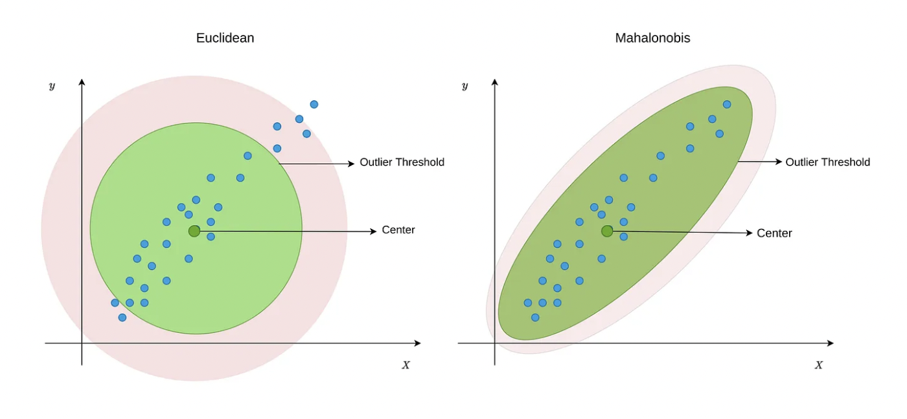

# Outlier {#sec-eda-outlier}

::: {.callout-note appearance="minimal"}
Quando analizziamo dati reali, è frequente imbattersi in osservazioni che si discostano in modo marcato dalla maggior parte delle altre. Questi valori anomali, comunemente chiamati *outlier*, possono avere origini molto diverse: errori di misurazione o di inserimento dei dati, ma anche casi estremi che rappresentano fenomeni reali e informativi.

Identificare e gestire correttamente gli outlier è fondamentale, perché essi possono influenzare in modo sproporzionato i risultati dell’analisi. Tuttavia, **non esiste una definizione universale di outlier**: ciò che è anomalo dipende dal contesto, dal modello utilizzato e dagli obiettivi dell’analisi. In questo capitolo esploreremo diversi metodi per individuare gli outlier, privilegiando approcci **robusti** che riducono l’influenza dei valori estremi sulle statistiche descrittive e inferenziali [@simmons2011false].
:::

### Panoramica del capitolo {.unnumbered .unlisted}

In questo capitolo impareremo a:

* comprendere il ruolo e gli effetti degli outlier nelle analisi statistiche;
* individuare outlier con metodi **univariati** e **multivariati**;
* utilizzare il pacchetto `{performance}` in R per la loro identificazione;
* documentare le decisioni in modo trasparente e riproducibile;
* valutare alternative alla rimozione (ad es. **winsorizzazione**) e l’importanza della **preregistrazione**.

::: {.callout-tip collapse=true}
## Prerequisiti

- Leggere "Check your outliers! An introduction to identifying statistical outliers in R with easystats" [@theriault2024check].
:::

::: {.callout-caution collapse=true title="Preparazione del Notebook"}

```{r}
here::here("code", "_common.R") |> 
  source()

# Load packages
if (!requireNamespace("pacman")) install.packages("pacman")
pacman::p_load(performance, see, datawizard, MASS)
```
:::


## Individuare e gestire gli outlier

L’identificazione e la gestione degli outlier (o valori anomali) rappresentano una fase critica e interpretativa dell’analisi dei dati. La maggior parte delle statistiche di sintesi e dei modelli più diffusi, come la media, la deviazione standard, il coefficiente di correlazione o i parametri di una regressione lineare, sono infatti altamente sensibili alla loro presenza. Un singolo valore estremo può distorcere in modo significativo i risultati, portando a conclusioni errate o fuorvianti.

Un classico esempio è il calcolo del reddito medio: l’inclusione accidentale di un dato estremamente elevato (ad es., di un miliardario in un campione di cittadini comuni) produrrà una media che non riflette affatto la condizione economica tipica del gruppo, alterando completamente la rappresentazione della realtà.

Tuttavia, è fondamentale ricordare che individuare un outlier non significa automaticamente eliminarlo. La sua gestione è una scelta metodologica che deve essere ponderata: un valore anomalo può essere un errore di misurazione da correggere, ma anche un’osservazione genuina e informativa che richiede un modello analitico più robusto o che, addirittura, costituisce il vero oggetto di studio. La decisione finale dipende sempre dal contesto sostanziale della ricerca e dalla domanda analitica che si intende affrontare.

### L'importanza della visualizzazione dei dati  

La visualizzazione è spesso il primo passo per individuare valori anomali. Strumenti come **boxplot**, **istogrammi** e **scatterplot** permettono di identificare rapidamente osservazioni che si discostano dalla distribuzione generale.

Tuttavia, queste tecniche sono efficaci soprattutto per outlier **unidimensionali** o **bidimensionali**. Quando il numero di variabili cresce, l’analisi visiva diventa insufficiente e sono necessari metodi statistici più strutturati, come la **distanza di Mahalanobis**.

## Come identificare gli outlier

### I boxplot
  
Il *boxplot* è uno strumento semplice e intuitivo. Riassume la distribuzione mostrando la mediana, il primo e il terzo quartile (Q1 e Q3) e due estremi, detti "whiskers". I punti al di fuori di questi whiskers sono considerati potenziali outlier.

Esempio in R:

```{r}
data <- data.frame(
  value = c(rnorm(100, mean = 10, sd = 2), 30)
  ) # Aggiungiamo un outlier

ggplot(data, aes(y = value)) +
  geom_boxplot() +
  coord_flip()
```

### Metodi basati sulla variabilità

#### Intervallo interquartile (IQR)

John Tukey ha introdotto una definizione operativa di outlier basata sull'*Interquartile Range* (IQR), ovvero la differenza tra il terzo e il primo quartile:

- i valori inferiori a $Q1 - 1.5 \times IQR$ o superiori a $Q3 + 1.5 \times IQR$ sono considerati outlier moderati;
- i valori oltre $Q1 - 3 \times IQR$ o $Q3 + 3 \times IQR$ sono definiti *far out* outliers.

Esempio in R:

```{r}
Q1 <- quantile(data$value, 0.25)
Q3 <- quantile(data$value, 0.75)
IQR_value <- Q3 - Q1
lower_bound <- Q1 - 1.5 * IQR_value
upper_bound <- Q3 + 1.5 * IQR_value

outliers <- data$value[data$value < lower_bound | data$value > upper_bound]
outliers
```

Questo metodo è robusto e semplice, ma può risultare meno efficace con distribuzioni fortemente asimmetriche.

#### Median Absolute Deviation (MAD)

Un metodo più robusto rispetto all'IQR è il *Median Absolute Deviation* (MAD), che utilizza la mediana anziché la media per stimare la dispersione:
  
```{r}
mad_value <- mad(data$value)
threshold <- 3 * mad_value # Soglia classica per gli outlier

outliers_mad <- data$value[abs(data$value - median(data$value)) > threshold]
outliers_mad
```

È spesso preferibile quando i dati non seguono una distribuzione normale.

## Outlier multivariati

Un’osservazione può non apparire anomala su una singola variabile, ma risultare atipica considerando **più variabili simultaneamente**. La **distanza di Mahalanobis** misura quanto ogni osservazione si discosta dal centro multivariato, tenendo conto delle **correlazioni** tra variabili.

- Con la distanza "normale" (come quella che misuri con un righello), se una persona è più alta o più pesante della media, la distanza è calcolata in modo "isolato", senza considerare che altezza e peso sono spesso correlate (persone più alte tendono a pesare di più).
- Con la distanza di Mahalanobis, invece, si osserva il "contesto" dei dati. Se tutti nel gruppo hanno un’altezza e un peso che crescono in modo coordinato (ad esempio, ogni 10 cm in più corrispondono a 8 kg in più), questa distanza valuta se la nuova persona si allontana da questo schema generale. Ad esempio, una persona molto alta ma con peso medio potrebbe essere considerata più "anomala" di una persona altrettanto alta ma più pesante, perché viola la relazione tipica del gruppo.

Per comprendere intuitivamente la distanza di Mahalanobis, immaginiamo di avere una nube di punti che rappresentano individui, ciascuno con i propri valori di altezza e peso. Il “centro” di questa nube è un punto ideale che rappresenta una sorta di media multivariata (tenendo conto sia dell’altezza sia del peso). La distanza di Mahalanobis misura quanto ogni singolo individuo si allontana da questo centro, considerando la variabilità congiunta delle variabili (ad esempio, la correlazione tra altezza e peso). Se un individuo presenta caratteristiche molto diverse rispetto alla maggioranza, la sua distanza di Mahalanobis sarà elevata, segnalando un potenziale outlier.

::: {#fig-maha-dist}
{width="70%"}

**Soglie per la detezione degli outliers** (bande grigie) nel caso di una metrica unidimensionale (pannello di sinistra) e nel caso di una rappresentazione multivariata della varianza (pannello di destra) -- figura creata da Sergen Cansiz.
:::

::: {.callout-tip title="Distanza di Mahalanobis" collapse="true"}
Consideriamo ora una definizione della distanza di Mahalanobis nel caso bivariato (due variabili). Immaginiamo di avere due variabili come altezza ($X$) e peso ($Y$), con:  

- **Medie**: $\mu_X$ (altezza media del gruppo), $\mu_Y$ (peso medio del gruppo).  
- **Varianze**: $\sigma_X^2$ (quanto varia l'altezza), $\sigma_Y^2$ (quanto varia il peso).  
- **Correlazione**: $\rho$ (quanto $X$ e $Y$ sono legate, ad esempio: se l'altezza aumenta, di quanto aumenta solitamente il peso?).

**Per un nuovo individuo** con altezza $x$ e peso $y$, la distanza di Mahalanobis ($D$) si calcola così:  

1. **Calcolare le differenze rispetto alla media**:  
   - Quanto si discosta l'altezza: $(x - \mu_X)$.
   - Quanto si discosta il peso: $(y - \mu_Y)$. 

2. **Scalare le differenze con le varianze**:  
   - Dividere ogni differenza per la sua "variabilità tipica" (deviazione standard $\sigma_X$ e $\sigma_Y$):  
   
     $$
     \frac{(x - \mu_X)}{\sigma_X} \quad \text{e} \quad \frac{(y - \mu_Y)}{\sigma_Y} .
     $$

3. **Correggere per la correlazione**:  

   - Se $X$ e $Y$ sono correlate ($\rho \neq 0$), modifica le differenze per tenere conto di come di solito si "muovono insieme".  
   - La formula finale combina tutto in un unico valore:  
     $$
     D = \sqrt{ \frac{ \left( \frac{(x - \mu_X)}{\sigma_X} \right)^2 + \left( \frac{(y - \mu_Y)}{\sigma_Y} \right)^2 - 2 \rho \left( \frac{(x - \mu_X)}{\sigma_X} \right)\left( \frac{(y - \mu_Y)}{\sigma_Y} \right) }{1 - \rho^2} }
     $$
     
**Spiegazione**:  

- Senza correlazione ($\rho = 0$), sarebbe come una distanza Euclidea "scalata" dalle varianze.  
- Con correlazione ($\rho \neq 0$), sottrai un termine che "aggiusta" la distanza in base a quanto $X$ e $Y$ tendono a variare insieme.  
- Il denominatore $1 - \rho^2$ normalizza il risultato, per evitare che la correlazione distorca troppo la misura.  

**Esempio**:  
Se tutti gli alti sono anche pesanti ($\rho$ positivo), un individuo alto ma magro avrà una distanza di Mahalanobis maggiore rispetto a uno altrettanto alto ma pesante, perché viola la relazione tipica del gruppo.  
:::

::: {.callout-tip title="Distanza Eucliea" collapse="true"}
Ricordiamo che la distanza euclidea tra due punti $(x_1, y_1)$ e $(x_2, y_2)$ in un piano cartesiano è definita come:

$$ 
d = \sqrt{(x_2 - x_1)^2 + (y_2 - y_1)^2} 
$$
:::

Esempio in R:

```{r}
X <- as.matrix(mtcars[, c("mpg", "hp")])
center <- colMeans(X)
cov_matrix <- cov(X)
mahal_dist <- mahalanobis(X, center, cov_matrix)

threshold <- qchisq(0.975, df = ncol(X)) # Soglia al 97.5%
outliers_mahal <- X[mahal_dist > threshold, ]
outliers_mahal
```

Questo metodo è utile per dataset con più variabili correlate, come misure biometriche (altezza e peso).

Tuttavia, la versione classica di questa misura non è particolarmente robusta: la presenza stessa di outlier può distorcere il calcolo del “centro” e della variabilità complessiva, rendendo meno affidabile l’individuazione di altri valori anomali. Per questo motivo, si preferisce utilizzare una variante più resistente, la Minimum Covariance Determinant (MCD), che diminuisce l’influenza degli outlier stessi nel processo di identificazione.

All’interno del pacchetto {performance} in R, è possibile applicare questa variante robusta utilizzando la funzione `check_outliers()` con l’argomento `method = "mcd"`. In questo modo, è possibile individuare gli outlier multivariati in maniera più solida e coerente, anche quando si lavora con dati fortemente influenzati da valori estremi.

```{r}
d <- mtcars[, c("mpg", "hp")]
outliers <- performance::check_outliers(d, method = "mcd", verbose = FALSE)
outliers
```

Si possono poi visualizzare questi outlier:

```{r}
plot(outliers)
```

Sono disponibili anche altre varianti multivariate documentate nella help page della funzione.

## Cosa fare con gli outlier?

Una volta identificati gli outlier, dobbiamo decidere se rimuoverli, correggerli o mantenerli [@leys2019classify]. Alcuni approcci comuni includono:

1. **Verificare la fonte del dato**: un errore di inserimento può essere corretto.
2. **Rimuovere gli outlier estremi**: utile se il valore è chiaramente un errore di misura.
3. **Usare metodi robusti**: strumenti come la mediana o il MAD sono meno influenzati dagli outlier.
4. **Trasformare i dati**: applicare logaritmi o altre trasformazioni può ridurre l'impatto degli outlier.
5. **Winsorizzazione**: invece di rimuovere gli outlier, possiamo limitarli a un massimo accettabile.

::: {.callout-tip title="Winsorizzazione" collapse="true"}
La **Winsorizzazione** è una tecnica per gestire gli outlier senza eliminarli. Invece di scartare i valori estremi, questi vengono sostituiti con il valore più vicino ritenuto "accettabile", preservando così la struttura e la dimensione del dataset.

**Come si applica?**
Il procedimento si articola in due passaggi principali:

1.  **Definire le soglie**  
    Si scelgono due percentili come limiti. Una scelta comune è utilizzare il **5° percentile** per il limite inferiore e il **95° percentile** per quello superiore.
    *   I valori al di sotto del 5° percentile sono considerati outlier "bassi".
    *   I valori al di sopra del 95° percentile sono considerati outlier "alti".
    *   I percentili possono essere adattati (es. 1° e 99°) a seconda della necessità di essere più o meno conservativi.

2.  **Sostituire i valori**  
    *   Tutti i dati **inferiori** al limite inferiore vengono portati al valore di quel limite (es. 5° percentile).
    *   Tutti i dati **superiori** al limite superiore vengono portati al valore di quel limite (es. 95° percentile).

**Esempio Pratico**

Consideriamo i voti di 10 esami, ordinati:  
`40, 55, 60, 65, 70, 75, 80, 85, 90, 200`

*   **Limite inferiore (5° percentile)**: 55
*   **Limite superiore (95° percentile)**: 90

**Applicando la Winsorizzazione**:

*   Il valore `40` (outlier basso) viene sostituito con `55`.
*   Il valore `200` (outlier alto) viene sostituito con `90`.

**Dataset winsorizzato**:  
`55, 55, 60, 65, 70, 75, 80, 85, 90, 90`

**Vantaggi e Applicazioni**

*   **Mantiene la dimensione del campione**: non si perdono osservazioni, si "aggiustano" solo gli estremi.
*   **Robustezza statistica**: riduce drasticamente l'influenza distorsiva degli outlier su indicatori sensibili come la media e la deviazione standard.
*   **Utilità pratica**: è particolarmente utile in campi come la psicologia (per contenere l'effetto di misurazioni estreme), dove l'eliminazione dei dati non è sempre desiderabile o giustificabile.
:::

Nel pacchetto **easystats**, la funzione `winsorize()` di **datawizard** semplifica il compito di Winsorizzazione:
  
```r
winsorized_data <- 
  winsorize(data$value, method = "zscore", robust = TRUE, threshold = 3)
```

## Importanza della trasparenza

Qualunque scelta fatta nella gestione degli outlier deve essere documentata in modo completo e replicabile. La trasparenza richiede di specificare chiaramente quanti outlier sono stati individuati, descrivendo il metodo di identificazione e le soglie applicate. È fondamentale dichiarare in che modo sono stati gestiti, se mantenuti, corretti o esclusi, e fornire il codice utilizzato per l'intera procedura, preferibilmente in linguaggi come R o Python.

Questa tracciabilità metodologica costituisce la base di una ricerca rigorosa. Pratiche come la preregistrazione del protocollo analitico e la condivisione aperta di dati e codice su piattaforme quali OSF, GitHub o Zenodo non sono semplicemente raccomandabili, ma rappresentano ormai lo standard imprescindibile per assicurare riproducibilità, credibilità e integrità scientifica.

## Riflessioni conclusive {.unnumbered .unlisted}

L’analisi degli outlier non è una procedura meccanica o puramente tecnica, ma una scelta metodologica sostanziale. L’obiettivo delle buone pratiche non è quello di “ripulire” i dati automaticamente, quanto piuttosto di comprendere l’origine dei valori anomali, applicare metodi coerenti con gli obiettivi della ricerca, e documentare con trasparenza e giustificazione ogni decisione presa. In questo quadro, la gestione degli outlier non è un passaggio secondario, ma parte integrante di un’analisi dei dati responsabile, che mira a garantire rigore, riproducibilità e validità interpretativa dei risultati.

::: {.callout-important title="Problemi 1" collapse="true"}
**Domande teoriche**

1. Cos'è un outlier?
2. Perché è importante identificare e trattare correttamente gli outlier?
3. Descrivi brevemente il metodo del boxplot per identificare gli outlier.
4. Cosa si intende per Interquartile Range (IQR) e come viene utilizzato per individuare gli outlier?
5. Qual è la differenza tra il metodo IQR e il Median Absolute Deviation (MAD) per l'identificazione degli outlier?
6. Cos'è la distanza di Mahalanobis e in che modo può aiutare nell'identificazione degli outlier multivariati?
7. Perché la distanza di Mahalanobis classica potrebbe non essere robusta? Come si può migliorare l'approccio?
8. Quali sono le opzioni per gestire gli outlier una volta identificati?
9. Cos'è la Winsorizzazione e in quali casi potrebbe essere utile?
10. Perché è importante la trasparenza nelle decisioni riguardanti gli outlier?
:::

::: {.callout-tip title="Soluzioni 1" collapse="true"}
1. **Cos'è un outlier?**

   - Un outlier è un'osservazione che si discosta significativamente dalla maggior parte delle altre osservazioni in un insieme di dati. Può essere dovuto ad errori di misura, errori di inserimento dati o a casi estremi ma validi.

2. **Perché è importante identificare e trattare correttamente gli outlier?**

   - Gli outlier possono distorcere i risultati dell'analisi statistica, portando a conclusioni errate. Identificarli e trattarli correttamente aiuta a ridurre l'effetto di questi valori anomali sulle statistiche descrittive e sulle inferenze statistiche.

3. **Descrivi brevemente il metodo del boxplot per identificare gli outlier.**

   - Il boxplot visualizza la distribuzione di una variabile, mostrando la mediana, il primo e il terzo quartile, e due estremi ("whiskers"). I punti al di fuori di questi whiskers sono considerati potenziali outlier.

4. **Cosa si intende per Interquartile Range (IQR) e come viene utilizzato per individuare gli outlier?**

   - L'IQR è la differenza tra il terzo e il primo quartile di un insieme di dati. Valori inferiori a $Q1 - 1.5 \times IQR$ o superiori a $Q3 + 1.5 \times IQR$ sono considerati outlier moderati. Valori oltre $Q1 - 3 \times IQR$ o $Q3 + 3 \times IQR$ sono definiti "far out" outliers.

5. **Qual è la differenza tra il metodo IQR e il Median Absolute Deviation (MAD) per l'identificazione degli outlier?**

   - Il metodo IQR si basa sulla differenza tra il terzo e il primo quartile, mentre il MAD utilizza la mediana delle deviazioni assolute dalla mediana per stimare la dispersione. Il MAD è meno sensibile agli outlier rispetto all'IQR e alla deviazione standard, rendendolo preferibile per dati con distribuzioni non normali.

6. **Cos'è la distanza di Mahalanobis e in che modo può aiutare nell'identificazione degli outlier multivariati?**

   - La distanza di Mahalanobis misura quanto un punto si discosta dal centro della distribuzione di un set di dati multivariato, tenendo conto della correlazione tra le variabili. Valori con distanze di Mahalanobis elevate sono potenziali outlier multivariati.

7. **Perché la distanza di Mahalanobis classica potrebbe non essere robusta? Come si può migliorare l'approccio?**

   - La distanza di Mahalanobis classica può essere distorta dalla presenza di outlier, che influenzano il calcolo del centro e della variabilità complessiva. Un approccio più robusto è la Minimum Covariance Determinant (MCD), che riduce l'influenza degli outlier nel processo di identificazione.

8. **Quali sono le opzioni per gestire gli outlier una volta identificati?**

   - Le opzioni includono: verificare la fonte del dato per possibili errori, rimuovere gli outlier estremi, usare metodi robusti come la mediana o il MAD, trasformare i dati (ad esempio, logaritmi), e limitare gli outlier attraverso la Winsorizzazione.

9. **Cos'è la Winsorizzazione e in quali casi potrebbe essere utile?**

   - La Winsorizzazione è una tecnica che consiste nel sostituire gli outlier estremi con il valore massimo o minimo accettabile. È utile quando si vuole mantenere la dimensione del dataset e ridurre l'impatto degli outlier senza rimuoverli completamente.

10. **Perché è importante la trasparenza nelle decisioni riguardanti gli outlier?**

  - La trasparenza aiuta a garantire la riproducibilità e la validità dell'analisi. Documentare le decisioni, inclusi i metodi e i threshold utilizzati, consente ad altri di capire e valutare l'impatto di queste decisioni sui risultati dell'analisi.
:::

::: {.callout-important title="Problemi 2" collapse="true"}
**Esercizio: Gestione degli Outlier nella Scala di Soddisfazione di Vita (SWLS)**

**Scopo:**  
Imparare a individuare e correggere gli outlier in un dataset che misura la soddisfazione di vita (SWLS). L’esercizio prevede l’inserimento artificiale di due outlier (uno molto alto e uno molto basso) nei dati raccolti, per poi gestirli con i metodi discussi nel capitolo. Infine, bisognerà consegnare:

1. Un file `.qmd` (Quarto) con tutto il codice e i commenti delle operazioni svolte.  
2. Un file CSV finale con i dati “puliti” (ossia senza i due outlier anomali) o con i valori modificati mediante il metodo scelto (winsorizzazione, rimozione, correzione, ecc.).

**Fasi e Istruzioni**

1. **Scarica o carica il dataset SWLS**  
   - Nominare il dataset originale, ad esempio *SWLS_raw.csv*, contenente i punteggi dei partecipanti sulla Scala di Soddisfazione di Vita (SWLS).  
   - Assicurati di avere nel dataset almeno le colonne:  
     - `id` (identificatore univoco del partecipante)  
     - `swls_score` (punteggio totale alla scala SWLS)

2. **Crea due outlier artificiali**  
   - Scegli **un partecipante** al quale assegnare un valore estremamente **basso** di `swls_score` (es. -999) e **un altro partecipante** con un valore estremamente **alto** (es. 999).  
   - Spiega brevemente nel `.qmd` dove e come hai inserito questi valori.  

3. **Analizza i dati alla ricerca di outlier**  
   - Visualizza la distribuzione tramite un boxplot e/o un istogramma.  
   - Calcola i valori soglia utilizzando **almeno uno** dei metodi visti:  
     - IQR (intervallo interquartile)  
     - MAD (Median Absolute Deviation)  
   - Mostra quali osservazioni vengono segnalate come potenziali outlier.  

4. **Decidi come gestire gli outlier**  
   - Scegli se rimuoverli, winsorizzarli o correggerli.  
   - Giustifica la tua scelta: spiega perché quel metodo è appropriato per questi dati o perché preferisci un approccio rispetto a un altro.

5. **Genera i dati “puliti”**  
   - Applica il metodo selezionato.  
   - Salva il dataset risultante (senza i valori anomali o con i valori modificati) in un file CSV chiamato *SWLS_clean.csv*.  

6. **Documenta tutto in un file `.qmd`**  
   - Includi codice R, commenti e brevi spiegazioni testuali dei vari passaggi.  
   - Mostra i risultati rilevanti (boxplot, calcolo dei soglie IQR/MAD, elenco degli outlier individuati, ecc.).  
   - Assicurati di eseguire il rendering del `.qmd` in modo che l’istruttore possa vedere sia l’output che il codice.

7. **Consegnare i file**  
   - **File .qmd**: deve contenere tutto il codice e i passaggi effettuati (inclusi grafici, calcoli e spiegazioni).  
   - **File CSV “pulito”** (*SWLS_clean.csv*): con i dati finali dopo il trattamento degli outlier.

**Suggerimenti**

- **Struttura** il tuo `.qmd` in sezioni (ad es. *Caricamento dati*, *Creazione outlier artificiali*, *Identificazione outlier*, *Gestione outlier*, *Salvataggio dati puliti*).  
- **Motiva** sempre le scelte, soprattutto se rimuovi o modifichi i dati originali: spiega perché il valore appare come un errore di misura o un valore estremo.  
- **Fai controlli incrociati**: potresti usare più di un metodo (boxplot, IQR, MAD) per vedere se l’outlier viene segnalato in tutti i casi.  
- **Documenta** la tua strategia di trasparenza nell’analisi: note sull’eventuale preregistrazione di come avresti gestito gli outlier o su come hai deciso i threshold.
:::

::: {.callout-note collapse=true title="Informazioni sull'ambiente di sviluppo"}
```{r}
sessionInfo()
```
:::

## Bibliografia {.unnumbered .unlisted}

