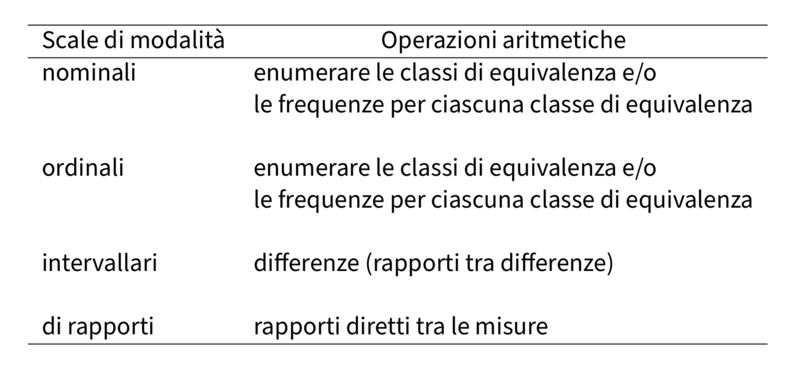
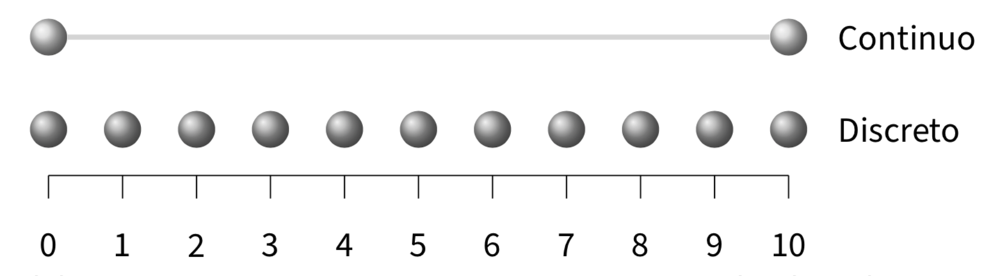

# La misurazione in psicologia {#sec-measurement}

::: {.callout-note appearance="minimal"}
Prima di calcolare una media, costruire un grafico o stimare un modello, è necessario chiedersi cosa rappresentano i numeri che abbiamo di fronte. In psicologia questa domanda è particolarmente importante, perché molti fenomeni di interesse, come ansia, stress, motivazione, benessere, autostima e attenzione, non sono osservabili direttamente. Li conosciamo attraverso risposte, comportamenti, tempi, scelte, punteggi o indicatori fisiologici. Ogni misura è quindi una traduzione imperfetta di un costrutto teorico in un dato osservabile.
:::

Questo capitolo introduce gli strumenti concettuali minimi per ragionare su questa traduzione. L'obiettivo non è memorizzare una tassonomia di scale di misura, ma imparare a porsi tre domande:

1. **Che cosa vogliamo misurare?**  
   Qual è il costrutto psicologico di interesse?

2. **Che cosa osserviamo davvero?**  
   Quale indicatore, risposta o comportamento viene registrato nei dati?

3. **Che cosa possiamo fare con quei valori?**  
   Quali descrizioni, grafici, statistiche e modelli sono coerenti con la natura della misura?

Queste domande collegano il capitolo precedente, dedicato al disegno della ricerca, ai capitoli successivi sull'analisi esplorativa dei dati. Anche il disegno migliore può produrre conclusioni fragili se le variabili osservate non rappresentano adeguatamente i costrutti che intendiamo studiare.

### Panoramica del capitolo {.unnumbered .unlisted}

In questo capitolo imparerai a:

- distinguere costrutti psicologici, indicatori osservabili e valori registrati;
- comprendere il ruolo dell'errore di misura;
- distinguere affidabilità e validità;
- usare i livelli di scala come strumenti diagnostici;
- riconoscere quali operazioni statistiche sono coerenti con una misura;
- discutere il caso delle scale Likert in modo non dogmatico;
- collegare la misurazione alla scelta di grafici, statistiche descrittive e modelli;
- comprendere perché la misurazione è un problema epistemologico, non solo tecnico.

::: {.callout-tip collapse=true title="Prerequisiti"}
Per seguire questo capitolo è utile avere chiari i concetti introdotti nei capitoli precedenti: fenomeno psicologico, domanda di ricerca, variabile, unità statistica, campione, popolazione, bias e incertezza.

Letture facoltative per chi desidera approfondire:

- @maul2016philosophical, sui fondamenti filosofici della misurazione psicologica;
- @lilienfeld2020psychological, sul rapporto tra misurazione psicologica e crisi della replicabilità;
- @stevens_46, per la tassonomia classica dei livelli di misura.

Queste letture non sono prerequisiti obbligatori. Il capitolo fornisce tutto il necessario per seguire il percorso introduttivo.
:::

## Perché la misurazione viene prima dell'analisi

Quando apriamo un dataset, vediamo righe, colonne e valori. È naturale pensare che il lavoro statistico inizi da lì. Ma quei valori sono il risultato finale di una serie di decisioni:

1. abbiamo scelto un fenomeno psicologico da studiare;
2. abbiamo formulato una domanda empirica;
3. abbiamo definito uno o più costrutti;
4. abbiamo scelto indicatori osservabili;
5. abbiamo raccolto risposte, comportamenti o misure;
6. abbiamo codificato queste osservazioni in variabili;
7. abbiamo organizzato le variabili in una matrice di dati.

Ogni passaggio può introdurre errore, ambiguità o bias. Per questo motivo, una variabile non è solo una colonna in un file, ma il risultato di una serie di scelte teoriche e operative.

::: {.callout-important title="Idea guida"}
In psicologia non misuriamo direttamente i costrutti. Osserviamo indicatori che li rappresentano in modo parziale, fallibile e dipendente dal contesto.
:::

Consideriamo l'esempio guida già introdotto nei capitoli precedenti:

> Gli studenti universitari che riportano livelli più alti di stress accademico dormono peggio?

Questa domanda contiene almeno due costrutti: *stress accademico* e *qualità del sonno*. Nessuno dei due è osservabile direttamente, come lo è la lunghezza di un tavolo. Dobbiamo quindi decidere come rappresentarli.

Per lo stress accademico potremmo usare:

- una scala self-report sulla pressione percepita;
- il numero di esami imminenti;
- il numero di ore di studio settimanali;
- una misura fisiologica, come la variabilità della frequenza cardiaca;
- una combinazione di più indicatori.

Per il sonno potremmo usare:

- ore di sonno dichiarate dallo studente;
- qualità soggettiva del sonno su scala Likert;
- diario del sonno;
- dati raccolti da un dispositivo indossabile;
- numero di risvegli notturni.

Queste scelte non sono equivalenti. Ciascuna misura coglie un aspetto diverso del fenomeno e presenta limiti specifici. Misurare significa stabilire quale relazione intendiamo instaurare tra il costrutto teorico e l'indicatore osservato.

## Costrutti, indicatori e dati

Un *costrutto* è un concetto teorico utilizzato per spiegare o descrivere un fenomeno psicologico. Esempi di costrutti sono ansia, depressione, intelligenza, stress, motivazione, impulsività e benessere. Sono utili perché aiutano a organizzare il pensiero teorico, ma non sono direttamente visibili.

Un *indicatore* è ciò che osserviamo per avvicinarci al costrutto. Può trattarsi di una risposta a un questionario, di un comportamento, di un tempo di reazione, di un numero di errori, di una scelta, di una valutazione da parte di un osservatore o di una misura fisiologica.

Un *dato* è il valore registrato per quell'indicatore in una specifica unità statistica.

| Livello | Esempio nello studio su stress e sonno |
|---|---|
| Costrutto | Stress accademico |
| Indicatore | Punteggio a una scala di stress percepito |
| Dato osservato | Uno studente ottiene 27 su 40 |

Questa distinzione è fondamentale. Il punteggio 27 non è *lo stress* dello studente. Si tratta di un valore osservato che, secondo una determinata teoria e una determinata procedura di misurazione, dovrebbe fornire informazioni sul suo stress accademico.

::: {.callout-tip title="Errore comune"}
Un errore frequente è quello di identificare il costrutto con il punteggio. Dire "lo stress è 27" è scorretto. È più prudente dire: "Lo studente ha ottenuto 27 con questo strumento che, si suppone, misuri lo stress accademico".
:::

## L'equazione fondamentale della misurazione

Una misura osservata può essere rappresentata in modo molto semplice:

$$
y = z + \varepsilon_y,
$$
dove:

- $y$ è il valore osservato;
- $z$ è il valore teorico del costrutto che vorremmo conoscere;
- $\varepsilon_y$ è l'errore di misura.

Questa equazione non va letta come una formula tecnica da applicare immediatamente, ma come una mappa concettuale. Ci ricorda che il dato osservato non corrisponde mai perfettamente al costrutto. Ogni misura contiene una componente informativa e una componente di errore.

Nel caso dello stress accademico, l'errore può nascere da molteplici fonti:

- lo studente interpreta male un item;
- risponde in modo socialmente desiderabile;
- compila il questionario in una giornata particolarmente difficile;
- la scala non copre bene tutte le dimensioni dello stress;
- alcuni item misurano l'ansia generale più che lo stress accademico;
- la modalità di somministrazione influenza le risposte.

L'equazione $y = z + \varepsilon_y$ aiuta a organizzare tre domande centrali.

| Domanda | Concetto collegato | Significato |
|---|---|---|
| Quanto rumore contiene la misura? | Affidabilità | La misura è stabile e coerente? |
| La misura cattura il costrutto giusto? | Validità | Stiamo misurando ciò che diciamo di misurare? |
| Quali operazioni sono legittime sui valori osservati? | Livello di scala | Media, differenze, rapporti e modelli hanno senso? |

## Affidabilità: quanto rumore contiene la misura

Una misura è *affidabile* quando produce risultati coerenti, stabili e poco rumorosi, a parità di ciò che si intende misurare. Se uno strumento è molto instabile, il valore osservato dipenderà eccessivamente da fattori accidentali.

L'affidabilità può assumere forme diverse:

- *stabilità nel tempo*: la misura produce risultati simili se ripetuta in condizioni comparabili;
- *coerenza interna*: gli item di una scala che dovrebbero misurare lo stesso costrutto tendono a muoversi insieme;
- *accordo tra valutatori*: osservatori diversi assegnano valutazioni simili agli stessi comportamenti;
- *precisione della procedura*: lo strumento registra valori con poca variabilità accidentale.

Una misura poco affidabile rende difficile individuare dei pattern nei dati. Se lo stress viene misurato con un elevato livello di rumore, l'associazione tra stress e sonno può apparire più debole, instabile o addirittura scomparire.

::: {.callout-note title="Precisione e bias"}
La precisione riguarda la variabilità accidentale delle misure. Il bias, invece, riguarda una distorsione sistematica. Uno strumento può essere preciso, ma distorto: può, per esempio, fornire valori molto coerenti, ma costantemente spostati nella stessa direzione.
:::

## Validità: stiamo misurando il costrutto giusto?

Una misura è *valida* nella misura in cui sostiene l'interpretazione che vogliamo attribuirle. La validità non è una proprietà magica dello strumento in sé, ma dipende dall'uso che se ne fa, dalla popolazione presa in esame, dal contesto e dalle conclusioni che si vogliono trarre.

Per esempio, una scala può essere valida per misurare lo stress accademico degli studenti universitari durante la sessione d'esame, ma non necessariamente per i lavoratori adulti, gli adolescenti o i pazienti clinici. Una misura può funzionare bene per descrivere le differenze tra i gruppi, ma può non essere adatta per prendere decisioni individuali.

Alcune domande utili sono:

- gli item coprono davvero il costrutto di interesse?
- la misura distingue il costrutto da fenomeni simili, ma diversi?
- i punteggi sono associati ad altri indicatori in modo coerente con la teoria?
- la misura funziona allo stesso modo in gruppi diversi?
- l'interpretazione dei punteggi è giustificata nel contesto specifico dello studio?

::: {.callout-important title="Affidabilità non basta"}
Una misura può essere affidabile, ma non valida. Un questionario può produrre punteggi molto stabili e coerenti, ma misurare l'ansia generale invece dello stress accademico.
:::

## Il livello di scala: quali operazioni sono legittime?

Dopo aver chiarito il rapporto tra costrutto e indicatore, dobbiamo chiederci che tipo di informazione è contenuta nei valori osservati. La tassonomia classica di @stevens_46 distingue quattro livelli di scala: nominale, ordinale, a intervalli e di rapporti.

Questa classificazione non deve essere imparata a memoria. Si tratta di uno strumento diagnostico che aiuta a stabilire quali operazioni statistiche e quali interpretazioni sono coerenti con la misura.

{ width=73% }

### Scala nominale

Una scala nominale classifica le osservazioni in categorie senza ordine intrinseco.

Esempi in psicologia:

- condizione sperimentale: controllo, trattamento, placebo;
- tipo di diagnosi;
- modalità di risposta scelta;
- gruppo di appartenenza.

Con una variabile nominale è possibile contare le frequenze, calcolare le proporzioni e identificare la categoria più frequente. Non ha senso calcolare la media delle etichette numeriche eventualmente usate per codificare le categorie.

::: {.callout-tip title="Esempio"}
Se codifichiamo controllo = 0 e trattamento = 1, i numeri sono etichette.  La media della variabile può essere utile come proporzione di partecipanti nel gruppo di trattamento, ma questo non significa che esista una quantità psicologica intermedia tra il gruppo di controllo e quello di trattamento.
:::

### Scala ordinale

Una scala ordinale introduce un ordine tra le categorie, ma non garantisce che le distanze tra categorie siano uguali.

Esempi:

- gravità dei sintomi: lieve, moderata, severa;
- giudizio di accordo: per nulla, poco, abbastanza, molto;
- posizione in una graduatoria;
- qualità del sonno valutata da 1 a 5.

Con i dati ordinali è possibile ordinare i valori, calcolare le mediane, i percentili e le frequenze cumulative. Dobbiamo invece essere cauti con le medie e le differenze, perché presuppongono che le distanze tra le categorie siano interpretabili.

### Scala a intervalli

Una scala a intervalli permette di interpretare le differenze tra valori. La distanza tra 10 e 20 ha lo stesso significato della distanza tra 40 e 50. Tuttavia, lo zero è un valore arbitrario e non indica l'assenza della proprietà misurata.

Esempi classici sono la temperatura in gradi Celsius o Fahrenheit e molti punteggi standardizzati, come alcuni punteggi psicometrici. Se un test ha una media di 100 e una deviazione standard di 15, una differenza di 15 punti può essere interpretata in relazione alla scala, ma non ha senso affermare che un punteggio di 120 rappresenta il doppio di un punteggio di 60.

Con le scale a intervalli hanno senso medie, differenze e deviazioni standard. Non hanno senso, invece, le interpretazioni basate su rapporti diretti tra valori.

### Scala di rapporti

Una scala di rapporti possiede tutte le proprietà di una scala a intervalli, ma ha anche uno zero non arbitrario che rappresenta l'assenza della quantità misurata. Ciò rende interpretabili i rapporti tra i valori.

Esempi:

- tempo di reazione;
- numero di errori;
- numero di parole ricordate;
- frequenza di un comportamento in un intervallo di tempo;
- durata di un'attività.

Se una persona impiega 800 millisecondi e un'altra 400, ha senso dire che il primo tempo è il doppio del secondo. Questa interpretazione è possibile perché lo zero della scala temporale non è una convenzione arbitraria.

### Una sintesi operativa

| Livello | Che cosa preserva | Operazioni tipiche | Esempio |
|---|---|---|---|
| Nominale | Identità/diversità | Frequenze, proporzioni, moda | Tipo di terapia |
| Ordinale | Ordine | Mediana, percentili, ranghi | Gravità dei sintomi |
| Intervalli | Differenze | Media, deviazione standard, differenze | Punteggio standardizzato |
| Rapporti | Rapporti | Tutte le operazioni precedenti più rapporti | Tempo di reazione |

::: {.callout-tip title="Errore comune"}
Assegnare dei numeri a una variabile non la rende automaticamente quantitativa. I numeri possono essere etichette, ranghi, punteggi approssimativi o vere e proprie misure quantitative. Il loro significato dipende dalla procedura di misurazione utilizzata.
:::

## Il test della trasformazione

Un modo pratico per capire se un'interpretazione è legittima consiste nel chiedersi quali trasformazioni dei valori non alterano il significato della misura.

- Per una scala nominale, è possibile cambiare le etichette senza alterare l'informazione.
- Per una scala ordinale, possiamo applicare trasformazioni monotone che preservano l'ordine.
- Per una scala a intervalli, possiamo cambiare l'origine e le unità di misura con trasformazioni lineari.
- Per una scala di rapporti, possiamo cambiare le unità di misura moltiplicando per una costante positiva, ma non possiamo spostare arbitrariamente lo zero.

::: {.callout-important title="Test della trasformazione"}
Se una conclusione cambia in modo sostanziale dopo una trasformazione che dovrebbe essere ammissibile per quel livello di scala, allora probabilmente stiamo attribuendo alla variabile proprietà metriche che non possiede.
:::

### Esempio pratico in R

Consideriamo risposte su una scala Likert da 1 a 5. Se trattiamo la scala come puramente ordinale, ciò che deve essere preservato è l'ordine. Se invece calcoliamo le medie e le differenze, stiamo facendo un'assunzione ulteriore: che le distanze tra le categorie siano interpretabili.

```{r}
# Risposte su scala Likert 1-5
likert <- c(2, 3, 4, 3, 5, 2, 4, 3, 4, 5)

# Trasformazione monotona: preserva l'ordine ma cambia le distanze
likert_monotona <- c(1, 2, 4, 2, 10, 1, 4, 2, 4, 10)

# La mediana è meno sensibile alla trasformazione monotona
median(likert)
median(likert_monotona)

# La media dipende invece dalle distanze numeriche assegnate
mean(likert)
mean(likert_monotona)
```

Questo esempio non dimostra che le medie su scala Likert siano sempre errate. Mostra, però, che la media incorpora un'assunzione: i valori numerici devono rappresentare distanze interpretabili. Se tale assunzione è fragile, le conclusioni basate sulle medie devono essere presentate con cautela.

## Il caso delle scale Likert

Le scale Likert sono molto diffuse in psicologia. Chiedono ai partecipanti di esprimere il loro grado di accordo, frequenza, intensità o valutazione soggettiva utilizzando categorie ordinate, solitamente da 1 a 5 o da 1 a 7.

Dal punto di vista strettamente statistico, ogni item Likert è ordinale: sappiamo che "molto d'accordo" indica un livello di accordo maggiore rispetto a "abbastanza d'accordo", ma non sappiamo se la distanza psicologica tra le categorie adiacenti sia costante.

Nella pratica, tuttavia, molte analisi trattano i punteggi Likert aggregati come approssimazioni di scale a intervalli. Questa scelta può essere ragionevole quando:

- il punteggio deriva dalla somma o dalla media di più item coerenti;
- la scala ha un numero sufficiente di categorie;
- la distribuzione non è estremamente asimmetrica o concentrata agli estremi.
- le conclusioni sono robuste rispetto ad analisi alternative;
- l'assunzione metrica viene dichiarata esplicitamente.

La soluzione non è vietare sempre le medie né usarle sempre senza riflettere. La soluzione è rendere esplicita l'assunzione.

::: {.callout-note title="Una posizione pragmatica"}
Trattare una scala Likert come approssimazione intervallare è una scelta modellistica, non una verità garantita dai dati. Può essere utile, ma va giustificata e controllata.
:::

### Raccomandazioni pratiche

Quando si lavora con scale Likert o punteggi psicologici simili:

1. specifica se stai analizzando singoli item o punteggi aggregati;
2. dichiara se tratti il punteggio come ordinale o approssimativamente intervallato;
3. Evita interpretazioni di rapporto, come "il doppio dell'accordo";
4. controlla le distribuzioni, i valori estremi e i pattern di risposta;
5. quando l'esito è centrale per la ricerca, valuta l'analisi di sensibilità o i modelli ordinali;
6. Collegare sempre l'interpretazione dei punteggi al costrutto teorico.

## Misure self-report, comportamentali e fisiologiche

Molte misure psicologiche sono *self-report*: chiedono alla persona di descrivere stati, atteggiamenti, emozioni o comportamenti. Questi strumenti sono preziosi perché molti fenomeni psicologici hanno una componente soggettiva accessibile solo attraverso il resoconto della persona.

Tuttavia, i self-report possono essere influenzati da:

- desiderabilità sociale;
- memoria imperfetta;
- interpretazione diversa degli item;
- stanchezza o scarsa attenzione;
- stile di risposta, per esempio tendenza ad accordarsi con le affermazioni;
- contesto di somministrazione.

Le misure comportamentali e fisiologiche sembrano talvolta più oggettive, ma non sono automaticamente più valide. Anche un tempo di reazione, il numero di errori o un indicatore fisiologico richiedono una teoria che spieghi perché quell'indicatore dovrebbe rappresentare il costrutto.

::: {.callout-tip title="Esempio"}
Un tempo di reazione più lento in un compito cognitivo può riflettere minore attenzione, maggiore cautela, difficoltà del compito, affaticamento, scarsa motivazione o una strategia di risposta diversa. Il dato è osservabile, ma la sua interpretazione richiede un modello teorico.
:::

## Variabili discrete e continue

Il livello di scala non esaurisce le proprietà di una variabile. Un'altra distinzione importante riguarda la granularità: alcune variabili sono discrete, altre continue.

Una *variabile discreta* assume valori separati, spesso interi. Esempi:

- numero di errori;
- numero di parole ricordate;
- numero di accessi a una piattaforma;
- numero di episodi in un periodo.

Una *variabile continua* può assumere, almeno idealmente, infiniti valori all'interno di un intervallo. Esempi:

- tempo di reazione;
- durata del sonno;
- altezza;
- intensità fisiologica misurata da uno strumento.

{ width=67% }

Questa distinzione è importante perché influenza la scelta dei grafici, delle statistiche descrittive e dei modelli. Per esempio, il conteggio degli errori non ha le stesse proprietà di una misura continua del tempo. Allo stesso modo, un punteggio su una scala con pochi valori possibili può richiedere cautele diverse rispetto a una misura realmente continua.

::: {.callout-note title="Collegamento con i modelli"}
Nei capitoli successivi, e soprattutto nel companion operativo su `brms` e `cmdstan`, il tipo di variabile aiuterà a scegliere la famiglia di distribuzioni: normale per molte misure continue, Bernoulli per esiti binari, binomiale per proporzioni, Poisson o negative binomial per conteggi, modelli ordinali per risposte ordinate.
:::

## Misurazione ed EDA

L'analisi esplorativa dei dati non è separata dalla misurazione. La scelta di un grafico o di una statistica descrittiva dipende dal tipo di variabile e dal significato dei valori.

Alcuni esempi:

- per le variabili nominali, sono utili le tabelle di frequenza e i grafici a barre;
- per le variabili ordinali, sono utili le frequenze ordinate, i percentili, le mediane e i grafici che preservano l'ordine;
- per le variabili quantitative, è possibile esplorare distribuzioni, medie, deviazioni standard, densità e boxplot.
- per i tempi di reazione o i conteggi, è necessario controllare le asimmetrie, i valori estremi e i vincoli naturali della scala.
- per le scale Likert, è spesso utile mostrare la distribuzione delle risposte prima di riassumerle in una media.

::: {.callout-tip title="Collegamento con R"}
In R, una variabile può essere codificata come numero anche se, concettualmente, è ordinale o nominale. Per esempio, una risposta da 1 a 5 può essere letta come numerica, ma questo non implica che ogni operazione aritmetica sia automaticamente significativa. La codifica informatica non sostituisce il ragionamento sulla misura.
:::

## Misurazione e inferenza bayesiana

Nel manuale principale, l'inferenza bayesiana verrà presentata come un metodo per aggiornare le credenze alla luce dei dati e rappresentare l'incertezza mediante distribuzioni di probabilità. La misurazione entra in questo processo in modo fondamentale.

Se il dato osservato è una misura imperfetta del costrutto, l'incertezza non riguarda solo il parametro del modello, ma anche il legame tra il costrutto e l'indicatore. In modelli più avanzati, questo legame può essere rappresentato esplicitamente attraverso modelli con errore di misura, modelli latenti o modelli gerarchici.

Per ora, non dobbiamo stimare questi modelli. È sufficiente tenere a mente una cautela:

> un modello statistico può essere molto sofisticato, ma le sue conclusioni dipendono sempre dalla qualità e dal significato delle misure osservate.

::: {.callout-important title="Idea per il manuale bayesiano"}
L'approccio bayesiano rende naturale distinguere ciò che osserviamo da ciò che vogliamo inferire. Questa distinzione è già presente nella misurazione: osserviamo $y$, ma siamo interessati a $z$.
:::

## Teoria e misurazione: un circolo virtuoso

La teoria e la misurazione si sostengono a vicenda.

Una teoria aiuta a decidere cosa misurare, quali indicatori utilizzare e quali modelli attendersi. Senza una teoria, rischiamo di accumulare numeri senza sapere cosa significano.

La misurazione, a sua volta, mette alla prova la teoria. Se un costrutto non può essere collegato a indicatori osservabili in modo chiaro, la teoria resta troppo vaga. Se gli indicatori non si comportano come previsto, può essere necessario rivedere la misura, la teoria o entrambe.

Nel percorso di questo modulo, questo circolo virtuoso ha una funzione pratica:

1. la teoria definisce il costrutto;
2. il disegno stabilisce come raccogliere dati utili;
3. la misurazione traduce il costrutto in variabili;
4. l'EDA controlla il comportamento di queste variabili nei dati;
5. il modello statistico formalizza una spiegazione o una previsione;
6. l'inferenza valuta quanto i dati sostengono il modello.

## Riflessioni conclusive {.unnumbered .unlisted}

La misurazione non è una fase preliminare da superare rapidamente prima della statistica. È il punto in cui la teoria entra nei dati.

Da questo capitolo dovremmo portare con noi cinque idee:

1. I costrutti psicologici non sono osservati direttamente.
2. Ogni dato è un indicatore imperfetto di qualcosa che vogliamo conoscere.
3. L'errore di misura può essere casuale o sistematico.
4. Affidabilità, validità e livello di scala rispondono a domande diverse.
5. Le analisi statistiche sono legittime solo se rispettano il significato della misura.

Nel prossimo blocco dedicato all'EDA, useremo queste idee per analizzare le variabili: controlleremo le distribuzioni, i valori mancanti, le codifiche, le anomalie e i pattern visivi, ricordando che un grafico o una statistica descrittiva hanno senso solo se conosciamo il significato dei dati.

## Esercizi {.unnumbered}

::: {.callout-important title="Problemi" collapse="true"}
1. Nello studio su stress accademico e sonno, identifica il costrutto, l'indicatore e il dato osservato per ciascuna delle seguenti variabili: punteggio a una scala di stress, ore di sonno dichiarate, qualità del sonno da 1 a 5.

2. Spiega, in massimo 8 righe, la differenza tra affidabilità e validità. Fai un esempio di misura affidabile ma non valida.

3. Per ciascuna variabile, indica il livello di scala più plausibile e giustifica la risposta: tipo di terapia, gravità dei sintomi in tre categorie ordinate, punteggio QI, tempo di reazione, numero di parole ricordate.

4. Una scala Likert da 1 a 5 misura l'accordo con l'affermazione "mi sento sotto pressione per gli esami". Quali assunzioni fai se calcoli la media delle risposte? Quali interpretazioni dovresti evitare?

5. Un ricercatore osserva che gli studenti con punteggio medio di stress pari a 30 dormono meno degli studenti con punteggio medio pari a 15 e conclude che "hanno il doppio dello stress". Perché questa interpretazione è problematica?

6. Scegli un costrutto psicologico, per esempio motivazione, ansia, impulsività o benessere. Proponi due indicatori possibili e discuti per ciascuno una fonte di errore di misura.

7. Spiega perché un tempo di reazione può essere una scala di rapporti, ma la sua interpretazione psicologica non è automaticamente semplice.
:::

::: {.callout-tip title="Soluzioni" collapse="true"}
**1. Costrutto, indicatore e dato osservato**

Il costrutto è ciò che vogliamo studiare teoricamente. L'indicatore è il modo in cui proviamo a osservarlo. Il dato è il valore registrato.

- Punteggio a una scala di stress: il costrutto è lo stress accademico; l'indicatore è la scala self-report; il dato è il punteggio ottenuto da uno studente.
- Ore di sonno dichiarate: il costrutto può essere quantità di sonno; l'indicatore è il resoconto dello studente; il dato è il numero di ore riportato.
- Qualità del sonno da 1 a 5: il costrutto è la qualità soggettiva del sonno; l'indicatore è la valutazione ordinata; il dato è il valore scelto.

**2. Affidabilità e validità**

L'affidabilità riguarda la coerenza e stabilità della misura. La validità riguarda la correttezza dell'interpretazione: la misura rappresenta davvero il costrutto di interesse? Una misura può essere affidabile ma non valida. Per esempio, una scala può produrre punteggi molto stabili, ma misurare ansia generale quando lo studio vuole misurare stress accademico.

**3. Livelli di scala**

- Tipo di terapia: nominale, perché le categorie non hanno un ordine naturale.
- Gravità dei sintomi in tre categorie: ordinale, perché le categorie sono ordinate ma le distanze non sono note.
- Punteggio QI: di solito trattato come scala a intervalli, perché le differenze sono interpretabili ma lo zero non indica assenza di intelligenza.
- Tempo di reazione: scala di rapporti, perché ha uno zero non arbitrario e i rapporti sono interpretabili.
- Numero di parole ricordate: scala di rapporti, perché è un conteggio con zero significativo.

**4. Media di una scala Likert**

Calcolare la media implica trattare i valori numerici come se le distanze tra categorie fossero abbastanza regolari. Questa può essere una scelta pragmatica, soprattutto con punteggi aggregati, ma va dichiarata. Bisogna evitare interpretazioni di rapporto, per esempio dire che un punteggio 4 indica il doppio dell'accordo rispetto a un punteggio 2.

**5. Interpretazione "doppio dello stress"**

L'interpretazione è problematica perché un punteggio di stress non possiede necessariamente uno zero assoluto né rapporti interpretabili. Anche se 30 è il doppio di 15 come numero, non segue che il costrutto psicologico misurato sia doppio. Il rapporto tra punteggio osservato e costrutto dipende dalla scala e dalla validità della misura.

**6. Due indicatori di un costrutto**

Per la motivazione allo studio, due indicatori possibili sono: un questionario self-report e il tempo effettivo dedicato allo studio in una settimana. Il questionario può essere influenzato da desiderabilità sociale o interpretazione degli item. Il tempo di studio può essere registrato in modo impreciso e non distingue studio concentrato da tempo passato sui libri senza attenzione.

**7. Tempo di reazione**

Il tempo di reazione è una scala di rapporti perché zero ha un significato non arbitrario e un tempo di 800 ms è il doppio di 400 ms. Tuttavia, l'interpretazione psicologica richiede cautela: un tempo più lento può indicare minore velocità di elaborazione, maggiore cautela, affaticamento, difficoltà del compito o una strategia diversa.
:::

## Bibliografia {.unnumbered}
