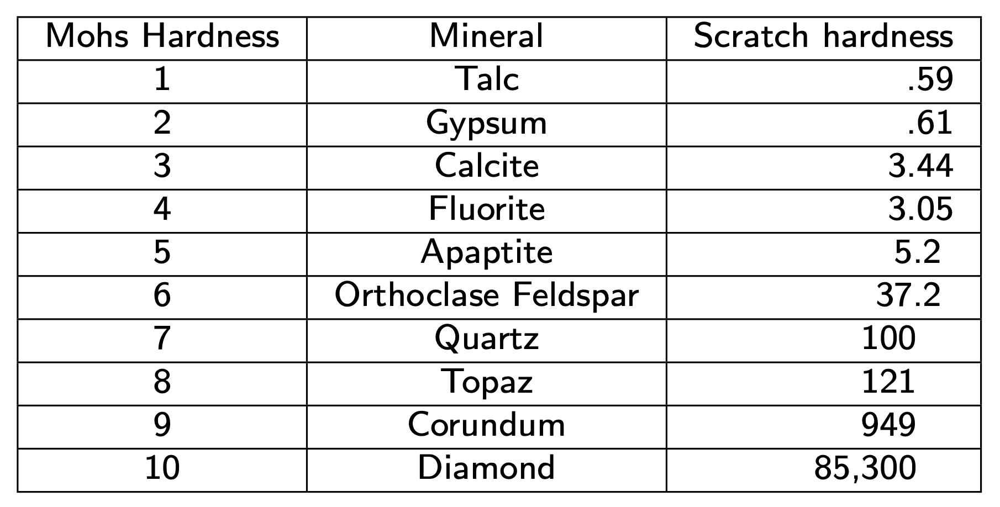
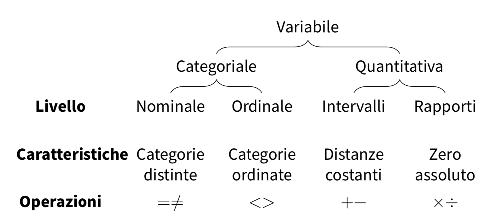

# La misurazione in psicologia {#sec-measurement}

::: {.callout-note appearance="minimal"}
Perché dedicare un intero capitolo alla misurazione? Perché gli errori commessi a questo livello si propagano in tutta l'analisi, spesso in modo invisibile. Un ricercatore può applicare i metodi statistici più sofisticati, ma se i dati di partenza sono stati misurati in modo inadeguato, o peggio ancora se sono stati trattati come se possedessero proprietà che in realtà non hanno, le conclusioni a cui giungerà saranno fragili o fuorvianti.

Questo capitolo parte da esempi concreti di errori di misurazione per poi introdurre gli strumenti concettuali che permettono di evitarli: l'equazione fondamentale della misurazione, la tassonomia delle scale di Stevens e il "test della trasformazione" per verificare il livello di scala appropriato. L'obiettivo non è memorizzare definizioni, ma sviluppare un'intuizione pratica che permetta di riconoscere quando un'operazione statistica è legittima e quando non lo è.
:::

### Panoramica del capitolo {.unnumbered .unlisted}

- Comprendere perché gli errori di misurazione compromettono la validità delle conclusioni.
- Conoscere le proprietà delle quattro scale di Stevens e le operazioni consentite da ciascuna.
- Applicare il "test della trasformazione" per verificare il livello di scala.
- Riconoscere il dibattito sulle scale Likert e le sue implicazioni pratiche.

::: {.callout-tip collapse=true}
## Prerequisiti

- Leggere [On the philosophical foundations of psychological measurement [@maul2016philosophical]](https://www.sciencedirect.com/science/article/pii/S0263224115005801?casa_token=QTLWp2GIWswAAAAA:wmewUxxK68plnyJhu51VMpVSnI4rB5wB36p4l1KlKarbFwhFTuIWUS7V5ZHdfhoqSqiy4JJoqg) sui fondamenti filosofici della misurazione psicologica.
- Leggere [Psychological Measurement and the Replication Crisis: Four Sacred Cows [@lilienfeld2020psychological]](https://web.p.ebscohost.com/ehost/pdfviewer/pdfviewer?vid=0&sid=52940ed5-6696-4f73-be23-b5f868703f25%40redis). Questo articolo mette in relazione le proprietà delle misure psicologiche con la crisi della replicabilità dei risultati della ricerca.
- Leggere il @sec-apx-numbers dell'Appendice.
:::

## Quando la misurazione fallisce

Prima di esaminare le definizioni formali, è istruttivo riflettere su due casi emblematici, che illustrano le conseguenze di una mancata comprensione della natura dei dati.

### Un caso eclatante: lo studio sul *mind-body healing*

Uno studio recente sul *mind-body healing*, pubblicato su *Nature* [@aungle2023physical](https://www.nature.com/articles/s41598-023-50009-3), riportava un'associazione tra pratiche mente-corpo e miglioramenti della salute fisica. Nonostante il prestigio della rivista, l'articolo è stato oggetto di severe critiche metodologiche, approfondite in particolare dallo statistico Andrew Gelman nel suo blog [Statistical Modeling](https://statmodeling.stat.columbia.edu/2025/01/27/does-anyone-actually-expect-meaningful-insight-to-come-from-a-study-like-this/).

Le critiche non riguardavano soltanto dettagli analitici, ma evidenziavano due carenze fondamentali e strettamente interconnesse.

**L'assenza di un quadro teorico solido:** il lavoro mancava di un chiaro fondamento concettuale. Che cosa si intende esattamente per "guarigione mente-corpo"? Quali potrebbero essere i meccanismi psicologici o fisiologici sottostanti? In che modo questa ipotesi si collega a teorie consolidate in neuroscienze, immunologia o psicologia della salute? Senza una cornice teorica che fornisca definizioni operative e collegamenti plausibili, i dati raccolti restano una collezione di numeri senza un contesto interpretativo, in grado al massimo di suggerire delle correlazioni, ma non di fornire delle spiegazioni.

**Le debolezze nella procedura di misurazione:** lo studio faceva uso di scale non validate e non teneva in considerazione in modo adeguato fattori confondenti cruciali, come l'effetto placebo. Il disegno sperimentale non garantiva un controllo sufficiente delle variabili, compromettendo la validità interna e la possibilità di trarre inferenze causali robuste. Inoltre, il campione utilizzato limitava fortemente la validità esterna, rendendo i risultati difficilmente generalizzabili.

Questo caso è paradigmatico di un principio generale: una misurazione inadeguata introduce *rumore* e *distorsione* nei dati, che possono mascherare relazioni autentiche o, ancor più problematicamente, generare associazioni spurie e conclusioni fuorvianti. 

### Un errore quotidiano: le scale Likert trattate come intervalli

Un errore metodologico meno eclatante, ma molto diffuso, riguarda il trattamento delle scale Likert come se fossero variabili quantitative su scala a intervalli. Consideriamo un tipico questionario che chiede ai partecipanti di esprimere il proprio grado di accordo con alcune affermazioni utilizzando una scala da 1 ("fortemente in disaccordo") a 5 ("fortemente d'accordo").

Supponiamo che un ricercatore calcoli il punteggio medio per due gruppi: il gruppo A ottiene 3.2, il gruppo B 3.5. Sulla base di questa differenza di 0.3 punti, il ricercatore potrebbe concludere che il gruppo B esprime un accordo "significativamente maggiore", attribuendo anche un significato clinico o sostanziale a tale scarto.

Tuttavia, questa interpretazione si basa su un presupposto non verificato: l'equivalenza delle distanze psicologiche tra i punteggi della scala. In altre parole, si presume che il "salto" cognitivo o esperienziale tra "1" (fortemente in disaccordo) e "2" (in disaccordo) sia equivalente a quello tra "4" (d'accordo) e "5" (fortemente d'accordo), un'ipotesi che raramente trova riscontro nella realtà. Il passaggio da un estremo all'altro della scala può infatti implicare cambiamenti qualitativi nell'atteggiamento che non sono né lineari né uniformi.

Se le distanze tra i valori non sono uguali, le operazioni aritmetiche come la media o la differenza perdono il loro significato metrico. Nonostante ciò, questo errore concettuale continua a essere riprodotto sistematicamente in una moltitudine di studi, compromettendo la validità di molte delle conclusioni tratte dai dati dei questionari.

## L'equazione fondamentale della misurazione

Ogni misurazione può essere descritta da un'equazione semplice ma fondamentale:

$$
y = z + \varepsilon_y,
$$
dove $y$ rappresenta il valore osservato (il punteggio o dato grezzo), $z$ il valore teorico o "vero" del costrutto che intendiamo misurare e $\varepsilon_y$ l'errore di misurazione.

Questa equazione mette in evidenza un fatto epistemologico cruciale: non abbiamo mai un accesso diretto a costrutti psicologici come l'ansia, l'intelligenza o la soddisfazione. Possiamo solo approssimarli attraverso indicatori osservabili che sono inevitabilmente contaminati dall'errore di misurazione. L'obiettivo della teoria della misurazione è controllare e ridurre l'errore di misurazione $\varepsilon_y$ e caratterizzarne l'entità.

L'equazione fondamentale della misurazione può essere esaminata da tre prospettive diverse:

1. **affidabilità**: quanto è grande $\varepsilon_y$? Uno strumento affidabile produce errori piccoli e non sistematici.

2. **validità**: $y$ cattura davvero $z$? Uno strumento può essere affidabile (con errori piccoli) ma misurare il costrutto sbagliato.

3. **livello di scala**: quali operazioni matematiche su $y$ sono legittime? Questa è la domanda centrale di questo capitolo.

## Le scale di Stevens: uno strumento diagnostico

La tassonomia proposta da @stevens_46 non è una semplice classificazione teorica, ma uno strumento **pratico e diagnostico** per prevenire errori di interpretazione. Ogni livello della scala – nominale, ordinale, a intervalli o di rapporti – stabilisce quali operazioni matematiche e statistiche siano *legittime* e dotate di significato, e quali siano invece *illegittime* e potenzialmente fuorvianti.

{ width=73% }

### Scala nominale

Questa scala organizza le osservazioni in categorie mutuamente esclusive, senza alcuna relazione di ordine intrinseca. Esempi includono: tipo di diagnosi clinica (depressione, ansia), genere, condizione sperimentale.

**Operazioni statistiche ammissibili:** contare le frequenze di ciascuna categoria, identificare la moda.
**Operazioni statistiche non ammissibili:** ordinare, calcolare medie, sommare o sottrarre valori.
**Trasformazioni ammissibili:** qualsiasi rietichettatura che preservi la partizione dei dati (es. "Condizione 1" → "Sperimentale").

### Scala ordinale

La scala ordinale introduce una relazione di ordine tra le categorie, ma senza specificare la distanza che le separa. Esempi: gravità dei sintomi (lieve, moderato, grave), livello di istruzione, posizione in classifica.

**Operazioni statistiche ammissibili:** ordinare i dati, calcolare mediana e percentili.
**Operazioni statistiche non ammissibili:** calcolare la media aritmetica, sommare o confrontare differenze tra categorie.
**Trasformazioni ammissibili:** qualsiasi trasformazione monotòna crescente (che preservi l'ordine delle categorie).

Un esempio paradigmatico è la scala di Mohs per la durezza dei minerali: sappiamo che il diamante (grado 10) è più duro del quarzo (grado 7), ma la scala non quantifica di quanto. Il rapporto tra i gradi non riflette un rapporto nella proprietà fisica sottostante.

{ width=65% }

### Scala a intervalli

La scala a intervalli aggiunge la proprietà fondamentale che le distanze (intervalli) tra i valori sono costanti e direttamente confrontabili. Tuttavia, lo zero della scala è arbitrario e non indica l'assenza della proprietà misurata. Esempi: temperatura in gradi Celsius o Fahrenheit, punteggi QI, data del calendario.

**Operazioni statistiche ammissibili:** sommare e sottrarre valori, calcolare medie e deviazioni standard.
**Operazioni statistiche non ammissibili:** calcolare rapporti diretti tra i valori (es. affermare che un valore è "il doppio" di un altro).
**Trasformazioni ammissibili:** trasformazioni lineari della forma $y' = a + by$ (con $b > 0$), che includono cambi di unità di misura e traslazioni dell'origine.

L'esempio canonico è la temperatura: possiamo correttamente affermare che la differenza tra 20°C e 30°C è uguale a quella tra 30°C e 40°C. Tuttavia, non è scientificamente valido sostenere che 40°C è "il doppio" di 20°C. Infatti, convertendo in Fahrenheit (20°C = 68°F, 40°C = 104°F), il rapporto numerico cambia radicalmente. Questo sottolinea un principio fondamentale: **le inferenze scientifiche devono essere invarianti rispetto a trasformazioni ammissibili della scala**. Un'affermazione che dipende da una specifica scelta arbitraria dell'origine o dell'unità di misura non descrive la realtà empirica, ma solo una convenzione numerica.

### Scala di rapporti

Questa scala possiede uno zero assoluto, che indica l'assenza della proprietà misurata, e intervalli costanti tra i valori. Esempi: tempo di reazione (in millisecondi), numero di errori, peso, altezza, temperatura in Kelvin.

**Operazioni statistiche ammissibili:** tutte le operazioni aritmetiche, inclusi rapporti e prodotti.
**Operazioni statistiche non ammissibili:** nessuna limitazione intrinseca.
**Trasformazioni ammissibili:** solo trasformazioni di similarità della forma $y' = by$ (con $b > 0$), che corrispondono a un semplice cambio di unità di misura.

Con una scala di rapporti, possiamo legittimamente affermare che un tempo di reazione di 400 ms è il doppio di uno di 200 ms, poiché tale rapporto rimane invariato qualsiasi unità di misura venga utilizzata (secondi, millisecondi).

{ width=69% }

## Conseguenze degli errori di scala

Cosa succede nella pratica quando si attribuisce a una variabile un livello di scala superiore a quello supportato dai suoi dati? Gli esempi seguenti illustrano le tipiche distorsioni che ne derivano:

| Errore | Esempio | Conseguenza metodologica |
|:-------|:--------|:------------|
| Nominale → Ordinale | Assegnare valori numerici 1, 2, 3 a categorie di etnia e successivamente ordinarle | Si impone una gerarchia arbitraria a dati puramente categoriali, producendo conclusioni prive di fondamento e potenzialmente discriminatorie. |
| Ordinale → Intervalli | Calcolare la media e la deviazione standard dei punteggi su una scala Likert | Si assume un'uguaglianza nelle distanze psicologiche tra le categorie che non è verificata, generando differenze numeriche illusorie e conclusioni statisticamente fragili e non replicabili. |
| Intervalli → Rapporti | Sostenere che un punteggio QI di 140 corrisponda a una "intelligenza doppia" rispetto a un punteggio di 70 | Si commette un grave errore concettuale, trattando lo zero arbitrario della scala come se fosse assoluto e interpretando i rapporti numerici in modo sostanzialmente fuorviante. |

L'errore più comune nella ricerca psicologica è il secondo: la frequente assimilazione delle scale ordinali a variabili quantitative su scala a intervalli. Ciò avviene sistematicamente quando si calcolano medie, varianze e parametri di correlazione su dati provenienti da scale Likert, senza alcuna validazione preliminare del presupposto di equidistanza tra i livelli di risposta. Tale pratica compromette la validità metrica delle conclusioni tratte da tali dati.

## Il test della trasformazione

Esiste un semplice criterio operativo per verificare se stiamo attribuendo a una variabile un livello di scala corretto, o se stiamo inconsapevolmente facendo un’assunzione metrica troppo forte:

> **Test della trasformazione:** se una trasformazione ammissibile per il livello di scala presunto (ad esempio, una trasformazione monotòna per una scala ordinale o una trasformazione lineare per una scala a intervalli) altera in modo sostanziale le conclusioni statistiche o interpretative, allora la variabile non possiede tutte le proprietà di quel livello. In altre parole, **stiamo trattando i dati a un livello superiore rispetto a quello consentito dalle loro proprietà intrinseche.**.

Questo test fornisce un **controllo di coerenza metrica** tra le operazioni che eseguiamo e la natura dei dati raccolti.

### Esempio pratico in R

Consideriamo risposte su una scala Likert da 1 a 5. Se la scala fosse effettivamente una misura a intervalli, dovrebbe essere invariante rispetto a trasformazioni lineari come lo spostamento dell'origine (es. passare a una scala 0-4).

```{r}
# Risposte originali su scala Likert 1-5
likert_1_5 <- c(2, 3, 4, 3, 5, 2, 4, 3, 4, 5)

# Trasformazione lineare: traslazione della scala in 0-4
likert_0_4 <- likert_1_5 - 1

# Calcolo delle medie (operazione ammissibile solo per scale a intervalli o superiori)
cat("Media scala 1-5:", mean(likert_1_5), "\n")
cat("Media scala 0-4:", mean(likert_0_4), "\n")
# Le medie cambiano, poiché l'origine della scala è stata traslata.

# Verifica dell'invarianza delle differenze (proprietà fondamentale delle scale a intervalli)
cat("Differenza primo-ultimo (scala 1-5):", likert_1_5[10] - likert_1_5[1], "\n")
cat("Differenza primo-ultimo (scala 0-4):", likert_0_4[10] - likert_0_4[1], "\n")
# Le differenze tra valori rimangono invariate, come atteso per una scala a intervalli.

# Test critico: invarianza dei rapporti (proprietà delle sole scale di rapporti)
cat("Rapporto tra le due medie:", mean(likert_1_5) / mean(likert_0_4), "\n")
# Il rapporto cambia, confermando che non siamo in presenza di una scala di rapporti.
```

Se una conclusione derivata dai dati può essere formulata come: "Il gruppo A mostra un accordo superiore del 50% rispetto al gruppo B", tale conclusione cambierebbe completamente a seguito del cambiamento della scala di origine. Ciò segnala in modo inequivocabile che stiamo trattando erroneamente una scala a intervalli come se fosse una scala di rapporti, commettendo un errore di livello di misura.

## Il caso speciale delle scale Likert

Le scale Likert meritano un approfondimento particolare, in quanto rappresentano lo strumento di misurazione più diffuso nella ricerca psicologica, nonostante la loro natura metrica rimanga ambigua e dibattuta.

### Il dibattito: scala ordinale o a intervalli?

Da un punto di vista puramente tecnico, una scala Likert è per definizione ordinale: stabilisce che la risposta "fortemente d'accordo" implica un grado di accordo maggiore rispetto a "d'accordo", ma non garantisce che la differenza esperienziale tra queste due categorie sia uguale a quella tra "d'accordo" e "neutrale". Tuttavia, nella pratica della ricerca, la maggior parte degli psicologi tratta i punteggi Likert come se formassero una scala a intervalli, calcolandone le medie e applicando loro statistiche parametriche (ad esempio, l'analisi della varianza o i modelli di regressione).

Questa pratica può essere giustificata pragmaticamente quando la scala possiede un numero sufficiente di punti (5-7), le distribuzioni dei punteggi sono approssimativamente simmetriche e le conclusioni principali rimangono sostanzialmente invariate anche quando si utilizzano metodi statistici più conservativi. In altre parole, l'assunzione di equidistanza può essere utile come approssimazione, **a condizione che se ne riconosca il carattere di convenzione operativa e che si verifichi la robustezza dei risultati a tale assunzione**.

### Raccomandazioni per un uso consapevole

La discussione teorica non deve paralizzare la ricerca, ma guidare verso pratiche più trasparenti e robuste. Per un utilizzo informato delle scale Likert, si raccomanda di:

1.  **Dichiarare esplicitamente l'assunzione** che si sta operando, considerando i punteggi come se fossero su scala a intervalli, e discuterne le possibili limitazioni;
2.  **Verificare la robustezza delle inferenze** utilizzando modelli che rilassino l'assunzione di distribuzioni parametriche specifiche (ad esempio, modelli a mistura o modelli con distribuzioni a coda pesante) o, in alternativa, applicando trasformazioni monotone robuste ai dati (ad esempio, trasformazioni basate sui ranghi) e confrontando la distribuzione a posteriori dei parametri chiave (ad esempio, la differenza di medie). Se le conclusioni sostanziali (la direzione e la credibilità dell'effetto) cambiano in modo marcato, ciò indica che l'inferenza è sensibile alle assunzioni parametriche e all'interpretazione metrica della scala.
3.  **Evitare categoricamente l'interpretazione dei rapporti**, come affermare che un punteggio medio di 4.0 rappresenti "il doppio" dell'accordo di un punteggio di 2.0. Questo tipo di affermazione è privo di fondamento metrico.
4.  **Valutare strumenti alternativi** per i costrutti fondamentali. Per fenomeni psicologici rilevanti, può essere opportuno privilegiare misure ancorate a *comportamenti osservabili* (ad esempio, frequenza di un'azione, latenza di risposta) o a *giudizi di osservatori esterni*, riducendo la dipendenza esclusiva da *giudizi introspettivi* (o *self-report*) dei partecipanti su categorie dalla definizione ambigua.

## Altri metodi di scaling psicologico

::: {.callout-note collapse=true}
## Cenni sullo scaling psicologico

La costruzione di una scala psicometrica non si limita al formato Likert. Esistono diverse metodologie classiche, ciascuna basata su principi teorici distinti e adatta a scopi di misurazione diversi.

**Scaling di Guttman:** questo approccio assume una struttura cumulativa unidimensionale degli item, ordinati in base alla loro difficoltà o intensità. Idealmente, l'endorsement di un item implica l'accordo con tutti gli item meno intensi che lo precedono. È particolarmente utile per valutare costrutti gerarchici, come la gravità di una sintomatologia o la padronanza di un'abilità.

**Scaling Thurstoniano:** il metodo si basa su giudizi comparativi. Ai partecipanti viene presentata una serie di coppie di stimoli (ad esempio, affermazioni o oggetti) tra cui devono esprimere una preferenza. La scala finale viene costruita aggregando queste scelte forzate e derivando un punteggio di preferenza relativa per ciascuno stimolo. È efficace per la misurazione di atteggiamenti e valori.

**Scaling Fechneriano:** basato sulla psicofisica classica, questo metodo si fonda sulla legge di Fechner, che postula una relazione logaritmica tra l'intensità dello stimolo fisico e la percezione soggettiva. La sua unità di misura fondamentale è la *differenza appena percettibile* (JND, *Just Noticeable Difference*). È lo strumento ideale per quantificare la percezione di grandezze sensoriali come luminosità, peso e intensità sonora.

La scelta del metodo di scaling più appropriato dipende criticamente dalla natura del costrutto psicologico in esame, dalle sue proprietà teoriche (ad esempio, se è cumulativo, comparativo o percettivo) e dalle domande di ricerca specifiche.
:::

Oltre al livello di scala (nominale, ordinale, ecc.), un'altra fondamentale classificazione delle variabili riguarda la loro *granularità*: la distinzione tra variabili discrete e continue.

- Le **variabili discrete** assumono valori in un insieme numerabile, tipicamente interi. Ogni valore rappresenta una categoria o un conteggio distinto. Esempi classici sono il numero di errori commessi in un compito o il numero di figli.
- le variabili continue possono assumere, almeno in linea di principio, un'infinità non numerabile di valori all'interno di un dato intervallo. Anche quando misurate con precisione finita (per esempio in millisecondi), rappresentano concettualmente una quantità che varia in modo continuo. Esempi sono il tempo di reazione e l'altezza.

Questa distinzione è importante perché influenza la scelta delle distribuzioni di probabilità (ad esempio, la distribuzione di Poisson per i conteggi discreti e la distribuzione normale per le misure continue) e delle tecniche di modellazione statistica più appropriate.

{ width=67% }

Questa distinzione influenza la scelta dei modelli statistici ma è indipendente dalla tassonomia di Stevens: una variabile può essere discreta a qualsiasi livello di scala.

## Teoria e misurazione: un circolo virtuoso

I casi discussi all'inizio del capitolo mettono in luce un principio fondamentale della ricerca empirica: la teoria e la misurazione sono inseparabili e si alimentano a vicenda in un processo dinamico.

**Trascurare la teoria** conduce a un **empirismo acritico**: si accumulano dati senza una cornice interpretativa che ne guidi la raccolta e ne assegni il significato. Il risultato è una collezione di numeri che, per quanto sottoposti a sofisticate analisi statistiche, non forniscono alcuna informazione sul fenomeno indagato.

**Trascurare la misurazione** porta a erigere **costrutti teorici su fondamenta inconsistenti**. Un'ipotesi concettualmente elegante, sottoposta a verifica con strumenti inaffidabili o invalidi, genera un'evidenza ambigua o fuorviante, vanificando il potenziale esplicativo della teoria stessa.

Il vero progresso scientifico emerge da un **circolo virtuoso** in cui la teoria informa la progettazione della misurazione (definendo *cosa* e *come* misurare), e i dati raccolti forniscono il feedback empirico necessario per affinare, correggere o persino rifiutare la teoria stessa.

Per lo psicologo ricercatore, coltivare questo circolo virtuoso richiede lo sviluppo integrato di tre dimensioni:

- **Consapevolezza epistemologica:** la capacità di valutare criticamente il nesso tra concetti astratti e indicatori operativi, distinguendo ipotesi plausibili da costruzioni arbitrarie.
- **Competenza metodologica:** la padronanza dei criteri per valutare l'affidabilità, la validità e l'adeguatezza metrica di uno strumento di misurazione rispetto al fenomeno in esame.
- **Umiltà quantitativa:** la consapevolezza costante che ogni dato rappresenta un'approssimazione intrinsecamente incerta, e che la legittimità di ogni operazione matematica o statistica è vincolata dalla natura della scala di misurazione sottostante.

## Riflessioni conclusive {.unnumbered .unlisted}

La misurazione in psicologia non è una semplice fase preparatoria da eseguire in fretta, ma un momento **decisivo** che determina la validità di ogni successiva analisi e inferenza. Ogni volta che convertiamo un fenomeno psicologico in un dato numerico, facciamo delle **assunzioni implicite** riguardo a ciò che quel numero rappresenta e alle operazioni matematiche che è lecito compiere su di esso.

La tassonomia di Stevens fornisce un **linguaggio concettuale** per rendere esplicite queste assunzioni, classificando il tipo di informazione catturata. Il "test della trasformazione" offre uno **strumento diagnostico** pragmatico per verificarne la coerenza. Tuttavia, lo strumento più potente rimane l'esercizio del pensiero critico metodologico: interrogarsi costantemente se le proprie conclusioni riflettano una proprietà del mondo studiato o siano soltanto un artefatto delle convenzioni numeriche adottate per rappresentarlo.

::: {.callout-important title="Problemi 1" collapse="true"}
**Esercizio 1: Identificazione del Livello di Misurazione**

**Obiettivo:** Comprendere i diversi livelli di misurazione applicati alla psicologia.

1. Identifica il livello di misurazione (nominale, ordinale, intervalli, rapporti) per ciascuna delle seguenti variabili psicologiche:

   - a) Tipo di terapia psicologica (Cognitivo-comportamentale, Psicodinamica, Umanistica)
   - b) Livello di ansia auto-riferito su una scala da 1 a 10
   - c) Numero di episodi depressivi in un anno
   - d) Tempo di reazione in millisecondi in un test cognitivo

**Esercizio 2: Confronto tra Scale**

**Obiettivo:** Comprendere le differenze tra le scale di misurazione.

1. Spiega la differenza tra una scala ordinale e una scala a intervalli utilizzando l'esempio della soddisfazione lavorativa.
2. Perché il punteggio QI è misurato su una scala a intervalli e non su una scala a rapporti?
3. In che modo il punteggio di una scala di autostima su una scala Likert differisce da una misurazione su una scala di rapporti?

**Esercizio 3: Operazioni Aritmetiche Consentite**

**Obiettivo:** Comprendere le operazioni matematiche consentite per ciascun livello di misurazione.

1. Quali operazioni aritmetiche sono ammissibili per una scala nominale?
2. Può avere senso calcolare la media di punteggi su una scala ordinale? Perché?
3. Se hai misurato il tempo di reazione in secondi, quali operazioni aritmetiche puoi eseguire?

**Esercizio 4: Trasformazioni Ammissibili**

**Obiettivo:** Comprendere le trasformazioni possibili per ogni scala di misurazione.

1. Se una variabile è misurata su una scala nominale, quale tipo di trasformazione è consentita?
2. Per una scala a intervalli, quali trasformazioni matematiche sono permesse senza alterare le proprietà della scala?
3. Quale tipo di trasformazione è consentita su una scala di rapporti?

**Esercizio 5: Applicazione delle Scale a Dati Psicologici**

**Obiettivo:** Applicare i concetti a contesti psicologici reali.

1. Una scala di ansia clinica fornisce punteggi compresi tra 0 e 100. Quale livello di misurazione è più appropriato e perché?
2. Un esperimento misura la memoria dichiarativa chiedendo ai partecipanti di ricordare un elenco di parole. Come dovrebbe essere misurata la variabile "numero di parole ricordate"?
3. In uno studio sulla personalità, i tratti vengono classificati come "estroverso" e "introverso". Qual è il livello di misurazione?

**Esercizio 6: Valutazione della Scala di Misurazione**

**Obiettivo:** Identificare la corretta scala di misurazione per vari fenomeni psicologici.

1. Il livello di aggressività misurato su una scala da 1 a 5 è nominale, ordinale, intervalli o rapporti? Giustifica la tua risposta.
2. Il numero di attacchi di panico in una settimana può essere considerato su scala ordinale? Perché sì o perché no?
3. Un test di intelligenza misura il QI con una media di 100 e una deviazione standard di 15. Qual è il livello di misurazione e quali sono le implicazioni per l'analisi statistica?

**Esercizio 7: Costruzione di una Scala Psicologica**

**Obiettivo:** Creare una scala di misurazione per una variabile psicologica.

1. Se dovessi costruire una scala per misurare la resilienza, quale livello di misurazione sceglieresti e perché?
2. Come potresti trasformare una scala nominale di preferenza musicale in una scala ordinale?
3. Un questionario sulla qualità della vita chiede ai partecipanti di valutare la loro felicità su una scala da 1 a 10. È una scala a intervalli o ordinale? Giustifica.

**Esercizio 8: Interpretazione Statistica dei Dati**

**Obiettivo:** Collegare il livello di misurazione alle tecniche statistiche appropriate.

1. Perché una mediana è più appropriata della media per dati ordinali?
2. Quale test statistico sarebbe più adatto per confrontare due gruppi su una variabile nominale?
3. Quali analisi possono essere condotte su dati raccolti su una scala a rapporti?

**Esercizio 9: Misurazione e Inferenze Psicologiche**

**Obiettivo:** Riflettere su come il livello di misurazione influisce sulle conclusioni di una ricerca.

1. Se un test di personalità usa una scala Likert da 1 a 7, quali precauzioni devono essere prese nell'interpretare le differenze tra punteggi?
2. Un questionario di benessere assegna punteggi tra 0 e 100, ma non ha uno zero assoluto. Quale scala è questa e quali sono le limitazioni?
3. In uno studio sulla depressione, i sintomi vengono codificati come "assenti", "moderati" o "gravi". Che tipo di scala è questa e quali statistiche possono essere usate per analizzarla?

**Esercizio 10: Esperimenti Psicologici e Misurazione**

**Obiettivo:** Applicare la teoria della misurazione nella progettazione di esperimenti psicologici.

1. Se un esperimento misura la memoria a breve termine con un compito di richiamo di parole, quale scala di misurazione utilizzeresti?
2. Come la scelta della scala di misurazione può influenzare le inferenze che si possono trarre da un esperimento?
3. Quali tipi di analisi statistica sono appropriati per dati misurati su scala ordinale rispetto a scala di rapporti?
:::

::: {.callout-tip title="Soluzioni 1" collapse="true"}
**Esercizio 1: Identificazione del Livello di Misurazione**

**Obiettivo:** Comprendere i diversi livelli di misurazione applicati alla psicologia.

1. Identifica il livello di misurazione (nominale, ordinale, intervalli, rapporti) per ciascuna delle seguenti variabili psicologiche:
   - a) **Nominale** (Tipo di terapia psicologica è una classificazione senza ordine)
   - b) **Ordinale** (Scala da 1 a 10, con ordine ma senza distanze uguali)
   - c) **Rapporti** (Numero di episodi depressivi ha uno zero assoluto e si possono fare rapporti tra valori)
   - d) **Rapporti** (Tempo di reazione ha uno zero assoluto e permette operazioni di rapporto)

**Esercizio 2: Confronto tra Scale**

**Obiettivo:** Comprendere le differenze tra le scale di misurazione.

1. La scala ordinale fornisce un ordine ma non permette di calcolare differenze precise, mentre la scala a intervalli ha differenze costanti tra i valori. Ad esempio, "soddisfazione lavorativa" su una scala da 1 a 5 è ordinale, mentre il punteggio di un test psicologico è a intervalli.
2. Il punteggio QI è a intervalli perché la differenza tra punteggi è significativa, ma non ha uno zero assoluto che rappresenta l'assenza di intelligenza.
3. Una scala Likert misura il livello di accordo con una dichiarazione, quindi è generalmente considerata ordinale, nonostante sia trattata spesso come una scala a intervalli.

**Esercizio 3: Operazioni Aritmetiche Consentite**

**Obiettivo:** Comprendere le operazioni matematiche consentite per ciascun livello di misurazione.

1. Nella scala nominale si può solo contare la frequenza delle categorie (ad es., il numero di partecipanti che usano un tipo di terapia).
2. No, la media su dati ordinali può essere fuorviante perché le distanze tra le categorie non sono necessariamente uguali. Meglio usare la mediana.
3. Sul tempo di reazione si possono eseguire tutte le operazioni aritmetiche, inclusa la media, la moltiplicazione e i rapporti tra valori.

**Esercizio 4: Trasformazioni Ammissibili**

**Obiettivo:** Comprendere le trasformazioni possibili per ogni scala di misurazione.

1. Sulla scala nominale, solo le trasformazioni di ricodifica (ad esempio, cambiare i nomi delle categorie) sono permesse.
2. Per una scala a intervalli, si possono effettuare trasformazioni lineari della forma y' = a + by con b > 0.
3. Per una scala di rapporti, sono consentite trasformazioni di similarità della forma y' = by, dove b > 0.

**Esercizio 5: Applicazione delle Scale a Dati Psicologici**

**Obiettivo:** Applicare i concetti a contesti psicologici reali.

1. Scala a intervalli, perché ha differenze costanti tra i punteggi ma nessuno zero assoluto.
2. Scala di rapporti, perché il numero di parole ricordate ha uno zero assoluto e consente operazioni di rapporto.
3. Nominale, perché non vi è un ordine gerarchico tra le categorie "estroverso" e "introverso".

**Esercizio 6: Valutazione della Scala di Misurazione**

**Obiettivo:** Identificare la corretta scala di misurazione per vari fenomeni psicologici.

1. Ordinale, perché il livello di aggressività segue un ordine, ma le differenze tra i livelli non sono necessariamente uguali.
2. No, perché il numero di attacchi di panico è una variabile discreta e misurabile su scala di rapporti.
3. Intervalli, perché il punteggio QI ha distanze costanti tra i valori, ma non ha uno zero assoluto.

**Esercizio 7: Costruzione di una Scala Psicologica**

**Obiettivo:** Creare una scala di misurazione per una variabile psicologica.

1. Ordinale o a intervalli, a seconda della precisione della misurazione della resilienza.
2. Si potrebbe assegnare un valore numerico crescente alle categorie di preferenza musicale per ottenere una scala ordinale.
3. È una scala ordinale, perché la differenza tra livelli non è necessariamente costante.

**Esercizio 8: Interpretazione Statistica dei Dati**

**Obiettivo:** Collegare il livello di misurazione alle tecniche statistiche appropriate.

1. Perché la mediana è meno sensibile ai valori estremi rispetto alla media.
2. Un test chi-quadrato è adatto per confrontare frequenze di dati nominali tra gruppi.
3. Si possono calcolare media, deviazione standard e utilizzare test parametrici come t-test o ANOVA.

**Esercizio 9: Misurazione e Inferenze Psicologiche**

**Obiettivo:** Riflettere su come il livello di misurazione influisce sulle conclusioni di una ricerca.

1. I punteggi Likert sono ordinali, quindi confronti tra differenze di punteggio devono essere interpretati con cautela.
2. Intervalli, perché non ha uno zero assoluto, il che limita l'uso di operazioni moltiplicative.
3. Ordinale, e si possono usare test non parametrici come il test di Kruskal-Wallis o il test di Mann-Whitney.

**Esercizio 10: Esperimenti Psicologici e Misurazione**

**Obiettivo:** Applicare la teoria della misurazione nella progettazione di esperimenti psicologici.

1. Rapporti, perché il numero di parole ricordate è una variabile discreta con uno zero assoluto.
2. Se si usa una scala ordinale, bisogna essere cauti nell'uso della media e della deviazione standard.
3. Scala ordinale → test non parametrici (Mann-Whitney); scala di rapporti → test parametrici (t-test, ANOVA).
:::

::: {.callout-important title="Problemi 2" collapse="true"}
**Esercizio 1 – Teoria Sostanziale e "Junk Science"**

**Obiettivo**: Riconoscere il ruolo di una teoria sostanziale solida e comprendere come la sua assenza possa compromettere uno studio.

1. Leggi la sezione in cui Gelman critica l'assenza di una teoria solida nello studio sulle pratiche mente-corpo.  
2. Spiega, in massimo **10 righe**, perché secondo Gelman la mancanza di una teoria coerente rende i risultati del suddetto studio "poco significativi" o addirittura "junk science".  
3. Proponi un esempio ipotetico (non correlato al mind-body healing) di uno studio psicologico che, pur presentando dati numerosi e analizzati con metodi statistici sofisticati, risulti privo di una teoria solida. Descrivi sinteticamente perché questo potrebbe rientrare nel concetto di "junk science".

**Esercizio 2 – Problemi di Misurazione**

**Obiettivo**: Identificare le criticità più comuni nella misurazione dei fenomeni psicologici.

1. Elenca almeno **tre** possibili fattori confondenti che potrebbero influenzare la misurazione dell'efficacia di un intervento psicologico (ad esempio, l'effetto placebo, le aspettative dei partecipanti, ecc.).  
2. Spiega come questi fattori confondenti potrebbero compromettere la **validità interna** dello studio.  
3. Indica almeno **due** caratteristiche fondamentali che una buona scala di misurazione (per una variabile psicologica) dovrebbe possedere per essere ritenuta affidabile e valida.

**Esercizio 3 – Precisione e Bias**

**Obiettivo**: Chiarire la distinzione tra precisione e distorsione (bias) e come questi aspetti si riflettano nella validità delle conclusioni.

1. Definisci, con parole tue, i concetti di **precisione** e **bias** in ambito psicometrico. 
2. Fornisci un esempio concreto di uno strumento di misura **preciso ma distorto** (bias elevato) e di uno strumento **poco preciso ma non distorto** (bias basso).  
3. Spiega come la combinazione di scarsa precisione e alto bias possa influire sulla possibilità di trarre conclusioni affidabili in uno studio psicologico.

**Esercizio 4 – Validità Interna ed Esterna**

**Obiettivo**: Approfondire come le scelte di misurazione influiscano sulla validità interna ed esterna di uno studio.

1. In riferimento allo studio sul mind-body healing discusso nel capitolo, identifica due fattori che potrebbero compromettere la validità interna e due fattori che potrebbero limitarne la validità esterna.  
2. Descrivi in **5-8 righe** le differenze principali tra validità interna e validità esterna, utilizzando esempi presi sia dal contesto della guarigione mente-corpo sia da altri contesti psicologici (ad esempio, studi sull'apprendimento o sulla motivazione).  
3. Proponi una modifica al disegno di ricerca (ipotetico) che potrebbe migliorare la validità interna dello studio originale. Spiega brevemente come questa modifica ne influenzerebbe anche la validità esterna.

**Esercizio 5 – Integrare Teoria e Misurazione: Breve Progetto di Ricerca**

**Obiettivo**: Mettere in pratica i concetti di teoria e misurazione attraverso la progettazione di uno studio.

1. Immagina di voler condurre uno studio su un intervento di "training di rilassamento mentale" finalizzato a ridurre l'ansia negli studenti universitari.  
2. **Sviluppa una breve traccia di progetto** (massimo **15 righe**) rispondendo ai seguenti punti:  
   - **Teoria di base**: Qual è la teoria sostanziale dietro l'efficacia del training di rilassamento? Quali meccanismi psicologici verrebbero attivati?  
   - **Ipotesi**: Quale effetto prevedi sull'ansia degli studenti?  
   - **Misurazione**: Che tipo di strumento useresti per valutare il livello di ansia e perché (ad esempio, questionari self-report validati, misure fisiologiche come battito cardiaco, ecc.)?  
   - **Controllo dei confondenti**: Quali variabili secondarie possono influire sui risultati e come intendi gestirle?  
   - **Validità**: Come assicureresti una buona validità interna? Che strategie adotteresti per aumentare la validità esterna?

3. Spiega brevemente in che modo la combinazione di un solido quadro teorico e di una misurazione accurata permette di evitare che lo studio venga etichettato come "junk science".
:::

::: {.callout-tip title="Soluzioni 2" collapse="true"}
**Esercizio 1 – Teoria Sostanziale e "Junk Science"**

1. Perché la mancanza di una teoria solida rende i risultati poco significativi?
- **Gelman** critica lo studio sul mind-body healing perché non vi è un modello teorico convincente che spieghi il **meccanismo causale** tra pratiche mente-corpo e miglioramenti di salute.  
- Senza un quadro teorico robusto, i risultati sono interpretati in modo **esplorativo** e rischiano di essere attribuiti a variabili non controllate (effetto placebo, regressione alla media, ecc.).  
- Una teoria ben formulata aiuta a **delimitare le ipotesi**, guidare il disegno di ricerca e interpretare correttamente i dati. In assenza di ciò, i numeri raccolti potrebbero essere viziati da fattori confondenti o da semplici correlazioni spurious.  

2. "Junk science" in massimo 10 righe

> *Esempio di testo in 10 righe (circa)*
>
> **Lo studio sul mind-body healing viene talvolta definito "junk science" da Gelman perché, in mancanza di una teoria sostanziale solida, i dati raccolti non forniscono indicazioni chiare sui processi psicologici o fisiologici coinvolti. Una ricerca classificata come "junk science" è priva di rigore metodologico o teorico, e può presentare gravi problemi di replicabilità o di interpretazione dei risultati. In particolare, se non vi è un modello plausibile che colleghi in modo coerente la pratica mente-corpo ai cambiamenti in variabili biologiche e comportamentali, i risultati empirici rischiano di essere semplici coincidenze. L'assenza di un costrutto ben definito e di ipotesi derivanti da una teoria coerente rende difficile capire se i cambiamenti osservati siano reali, casuali o dovuti ad altre cause non considerate (per esempio, l'effetto placebo). Infine, senza un'adeguata cornice teorica, gli studiosi non sanno come interpretare o generalizzare i dati, e la scienza non progredisce realmente.*  

3. Esempio di uno studio privo di teoria solida (ipotesi di "junk science")

- **Situazione ipotetica**: Uno studio che raccoglie decine di variabili sulla personalità e sul benessere, poi usa tecniche statistiche sofisticate (analisi di big data, reti neurali, ecc.) per trovare correlazioni fra i tratti di personalità e centinaia di indicatori fisici.
- **Perché "junk science"**: Se lo studio non definisce **a priori** quali ipotesi testare e non ha una teoria chiara che spieghi perché certe caratteristiche di personalità dovrebbero correlarsi con determinati parametri fisici, i risultati trovati potrebbero essere frutto di coincidenze casuali. Inoltre, in assenza di un modello teorico solido, anche risultati statisticamente significativi possono essere privi di significato dal punto di vista psicologico.

**Esercizio 2 – Problemi di Misurazione**

1. Tre possibili fattori confondenti nell'efficacia di un intervento psicologico

  - **Effetto placebo**: I partecipanti migliorano perché si aspettano di migliorare, non per l'effettiva efficacia dell'intervento.  
  - **Aspettative dei partecipanti**: Se sanno di partecipare a uno studio, potrebbero modificare il proprio comportamento (effetto Hawthorne).  
  - **Desiderabilità sociale**: I partecipanti forniscono risposte che ritengono socialmente desiderabili, falsando i risultati (ad esempio, sottostimando i livelli di ansia o stress).

2. Come questi fattori confondenti compromettono la validità interna

- La **validità interna** riguarda il grado in cui è possibile concludere che sia effettivamente la **variabile indipendente** (l'intervento) a causare le modifiche osservate nella **variabile dipendente** (es. livelli di ansia).  
- Se subentrano l'effetto placebo, aspettative non controllate o tendenze alla desiderabilità sociale, diventa difficile stabilire un nesso causale chiaro. Esiste sempre il dubbio che altri processi cognitivi o sociali (non l'intervento in sé) abbiano prodotto il risultato.

3. Due caratteristiche fondamentali di una buona scala di misurazione

  - **Affidabilità**: Capacità dello strumento di fornire misure stabili e coerenti nel tempo (ad esempio, coerenza interna, stabilità test-retest).  
  - **Validità**: Capacità dello strumento di misurare effettivamente ciò che si propone di misurare (validità di contenuto, di costrutto, di criterio).

**Esercizio 3 – Precisione e Bias**

1. Definizioni di precisione e bias

- **Precisione**: Indica il grado di dispersione (o variabilità) delle misurazioni. Uno strumento preciso produce misure molto simili fra loro se ripetute nelle stesse condizioni (bassa varianza).  
- **Bias (distorsione)**: Indica l'errore sistematico, ossia la tendenza a sovra- o sottostimare sistematicamente il fenomeno in esame. Uno strumento può essere molto coerente nelle misure, ma se è "tarato" male, darà sempre un risultato distorto.

2. Esempio concreto di misura "precisa ma distorta" e "poco precisa ma non distorta"

- **Precisa ma distorta**: Un cronometro che, a causa di un difetto di fabbricazione, parte sempre con 2 secondi di ritardo ma poi misura i tempi con estrema coerenza. Risultato: tutte le misure saranno molto simili (alta precisione), ma sempre sfasate di 2 secondi (alto bias).  
- **Poco precisa ma non distorta**: Un termometro vecchio che a volte segna 36,2°C, altre 36,7°C, altre 37,1°C, senza un pattern sistematico. In media potrebbe risultare vicino ai 36,5°C, quindi senza un bias chiaro, ma con un'alta variabilità tra una misurazione e l'altra (bassa precisione).

3. Conseguenze di scarsa precisione e alto bias

- Se uno strumento è **poco preciso** (alta variabilità) e **altamente distorto** (bias elevato), i risultati ottenuti non solo oscillano in modo imprevedibile, ma sono costantemente lontani dal valore "vero".  
- In queste condizioni, le **conclusioni diventano inaffidabili**, poiché è quasi impossibile distinguere l'effetto reale (casuale o causale) dalle deformazioni introdotte dallo strumento e dall'errore di misura.

**Esercizio 4 – Validità Interna ed Esterna**

1. Due fattori che compromettono la validità interna e due fattori che compromettono la validità esterna (nell'esempio del mind-body healing)

- **Validità interna**:  

  - **Assegnazione non casuale ai gruppi**: se i partecipanti scelgono autonomamente di aderire alle pratiche mente-corpo, potrebbero essere più motivati o avere caratteristiche iniziali diverse.  
  - **Mancata o inadeguata gestione dell'effetto placebo**: non sapere se l'intervento "mente-corpo" sia stato percepito come particolarmente "speciale" dai partecipanti può introdurre differenze di aspettativa.

- **Validità esterna**: 

  - **Campione non rappresentativo**: se lo studio è condotto solo su persone che frequentano un determinato tipo di centro di benessere, i risultati potrebbero non essere generalizzabili all'intera popolazione.  
  - **Contesto specifico**: pratiche mente-corpo svolte in un ambiente estremamente controllato (es. un laboratorio o un ritiro speciale) potrebbero non replicarsi nella vita quotidiana di chiunque.

2. Differenze tra validità interna ed esterna (5-8 righe di esempio)

> La validità interna si riferisce alla correttezza del disegno di ricerca nel dimostrare un effetto causale. Un alto livello di validità interna implica che i ricercatori siano ragionevolmente sicuri che l'intervento (ad esempio, una tecnica mente-corpo) abbia causato i risultati osservati (miglioramento della salute). La validità esterna, invece, riguarda la possibilità di generalizzare i risultati a contesti, persone e tempi differenti. Se un intervento è stato testato in condizioni molto specifiche, potrebbe funzionare bene solo in quel contesto e con quel particolare campione. Per esempio, un intervento sul mind-body healing con individui altamente motivati potrebbe non dare gli stessi risultati in una popolazione generalizzata. Allo stesso modo, uno studio sull'apprendimento condotto in un laboratorio altamente controllato potrebbe non riflettere le reali dinamiche di un'aula scolastica.

3. Modifica al disegno di ricerca per migliorare la validità interna e conseguenze sulla validità esterna

  - **Proposta**: Introdurre un gruppo di controllo con un intervento placebo o un'attività simile ma priva di contenuto "mente-corpo" (ad es. sessioni di lettura rilassante). In questo modo, si può confrontare l'effetto "specífico" dell'intervento.
  - **Come influenza la validità interna**: Con un gruppo di controllo placebo, diventa più semplice escludere che il miglioramento sia dovuto solo alle aspettative dei partecipanti. Questo riduce il rischio di confondenti e aumenta la validità interna.
  - **Come influenza la validità esterna**: Potrebbe rendere il contesto dello studio più artificiale (un gruppo fa "meditazione", l'altro legge in silenzio), il che potrebbe ridurre la naturalezza della situazione e potenzialmente limitare la generalizzabilità ad ambienti reali (validità esterna).

**Esercizio 5 – Integrare Teoria e Misurazione: Breve Progetto di Ricerca**

1. Breve traccia di progetto: "Training di rilassamento mentale per ridurre l'ansia negli studenti universitari"

- **Teoria di base**  
  Il training di rilassamento mentale si fonda sul presupposto teorico che le tecniche di riduzione dello stress (es. respirazione consapevole, rilassamento muscolare progressivo) possano agire sui livelli di attivazione fisiologica e sui pensieri intrusivi. Riducendo l'iperattivazione del sistema nervoso simpatico e favorendo uno stato di calma, diminuisce l'ansia percepita.

- **Ipotesi**  
  Gli studenti che seguono il training di rilassamento per 4 settimane mostreranno una riduzione significativa nei punteggi di ansia, rispetto a un gruppo di controllo che non partecipa al training.

- **Misurazione**  
  Utilizzo di una scala validata come lo **STAI (State-Trait Anxiety Inventory)** per misurare il livello di ansia pre e post intervento. Possibile integrazione con misure fisiologiche (battito cardiaco a riposo) per avere dati oggettivi.

- **Controllo dei confondenti**  
  - Registrare la storia clinica dei partecipanti (per escludere coloro che assumono farmaci ansiolitici).  
  - Richiedere che i partecipanti non modifichino drasticamente le proprie abitudini di studio o di vita durante l'intervento.  
  - Assicurarsi che i valutatori non sappiano chi fa parte del gruppo di training o del gruppo di controllo (blinding parziale).

- **Validità**  
  - **Validità interna**: Uso di un gruppo di controllo e assegnazione casuale (randomizzazione) per assicurare che i due gruppi siano comparabili.  
  - **Validità esterna**: Inclusione di studenti provenienti da diverse facoltà, così da riflettere una maggiore eterogeneità di popolazione.

2. Come teoria solida e misurazione accurata evitano la "junk science"

- Una solida **cornice teorica** spiega i meccanismi psicologici e fisiologici che legano l'intervento (training di rilassamento) all'esito (riduzione dell'ansia).  
- Una **misurazione accurata e validata** (STAI, misure fisiologiche) riduce errori e distorsioni. Se le misure sono ripetute nel tempo (pre e post), si possono confrontare i cambiamenti effettivi.  
- Integrando teoria e misurazione, i risultati assumono un significato scientifico più robusto. Non basta osservare un miglioramento: occorre dimostrare **come e perché** tale miglioramento avvenga, evitando di cadere in semplici correlazioni prive di spiegazione (e quindi potenzialmente "junk science").
:::

::: {.callout-important title="Problemi 3" collapse="true"}
**Esercizio 1 – Trasformazioni in Scala Nominale**

**Situazione**  
Un ricercatore vuole indagare la percezione di appartenenza sociale tra studenti universitari di Psicologia. A ciascuno studente viene chiesto di rispondere alla domanda: "Qual è il gruppo studentesco a cui ritieni di appartenere maggiormente?", scegliendo una tra le seguenti categorie:  

- A) Gruppo A (focalizzato su ricerca e studio)  
- B) Gruppo B (focalizzato su attività ricreative)  
- C) Gruppo C (focalizzato su volontariato e progetti sociali)

**Istruzioni**  

1. Identifica la **scala** di misurazione utilizzata per classificare gli studenti (nominale, ordinale, a intervalli o di rapporti).  
2. Indica **quali trasformazioni** sono ammissibili su questa scala e spiega perché non è possibile applicare operazioni di tipo aritmetico (somme, differenze, etc.).  
3. Proponi un esempio di **nuova scala nominale** equivalente, ossia una nuova denominazione delle categorie che rispetti la suddivisione originale. (Esempio: rinominarle in Gruppo X, Gruppo Y, Gruppo Z, oppure usare colori, animali-simbolo, ecc.). Spiega perché questa trasformazione non altera i risultati dell'indagine.

**Esercizio 2 – Trasformazioni in Scala Ordinale**

**Situazione**  
In un questionario sul benessere psicologico, agli studenti viene chiesto di classificare il loro **stato di motivazione** allo studio su una scala da 1 (bassa motivazione) a 5 (alta motivazione). Si ottiene così un dato ordinalmente misurato.

**Istruzioni**  

1. Spiega perché tale variabile ("livello di motivazione") rappresenta una **scala ordinale**. Quali proprietà la rendono diversa da una semplice scala nominale?  
2. Descrivi in che modo è possibile **ridenominare** i valori della scala (ad esempio, da [1,2,3,4,5] a ["Molto bassa", "Bassa", "Media", "Alta", "Molto alta"]) senza alterare il **rapporto d'ordine** tra le categorie.  
3. Proponi un esempio di **trasformazione non ammissibile**: qual è un'operazione aritmetica che non avrebbe senso applicare su una scala ordinale e perché (ad esempio, calcolare "il doppio di motivazione")?

**Esercizio 3 – Trasformazioni in Scala ad Intervalli**

**Situazione**  
Un gruppo di ricercatori in Psicometria vuole confrontare i **punteggi di un test d'intelligenza** (misurati secondo la scala tradizionale del QI, con media 100 e deviazione standard 15) con un nuovo test sperimentale. Come ben noto, la scala del QI è considerata, nelle sue approssimazioni psicometriche, una **scala ad intervalli**.

**Istruzioni**  

1. Spiega in cosa consiste la **trasformazione lineare** ammessa (del tipo $y' = a + b y$, con $b > 0$) e perché tale trasformazione preserva le **differenze** tra i punteggi.  
2. Fai un esempio concreto di trasformazione lineare: supponi di voler "riscalare" i punteggi del QI in modo che la nuova media sia 50. Definisci i valori di $a$ e $b$ (indicando un'ipotesi di calcolo) e mostra come viene modificato il punteggio di un individuo con QI = 115.  
3. Discuta perché, nonostante la somiglianza con le scale ordinale e nominale (puoi comunque distinguere punteggi e ordinarli), una **scala ad intervalli** consente operazioni matematiche più complesse (ad esempio, differenze) che non sarebbero valide negli altri due livelli.

**Esercizio 4 – Trasformazioni in Scala di Rapporti**

**Situazione**  
Un laboratorio di psicofisiologia misura i **tempi di reazione** (in millisecondi) a uno stimolo luminoso. Poiché il tempo di reazione pari a 0 ms significa realmente assenza di risposta (ovvero, impossibile da misurare in pratica, ma concettualmente corrisponde a intensità nulla del fenomeno "tempo di reazione"), ci troviamo in una **scala di rapporti**.

**Istruzioni**  

1. Spiega perché il tempo di reazione soddisfa i requisiti di una scala di rapporti, inclusa la presenza di uno **zero assoluto** e la possibilità di confrontare i punteggi con rapporti (ad esempio, "il tempo di reazione del partecipante A è il doppio di quello del partecipante B").  
2. Quali sono le **trasformazioni ammissibili** su una scala di rapporti? Fornisci un esempio numerico (per esempio, se moltiplichi tutti i tempi di reazione per 2, che cosa accade al rapporto tra i punteggi di due partecipanti?).  
3. Descrivi il motivo per cui è possibile dire che **A ha una latenza doppia di B** usando i millisecondi, ma non è sempre possibile fare asserzioni analoghe usando scale ad intervalli. Fai un parallelo, ad esempio, con le temperature in Celsius.

**Esercizio 5 – Riconoscere e Applicare le Trasformazioni nei Quattro Livelli di Scala**

**Situazione**  
Un docente di Psicologia sperimentale ha raccolto quattro serie di dati su vari aspetti:  

1. **Orientamento politico** (liberale, conservatore, centrista, ecc.).  
2. **Classifica di soddisfazione** sul tirocinio (1° posto, 2° posto, 3° posto, etc.).  
3. **Punteggi di un test di personalità** su un fattore (con media = 100, deviazione standard = 10) trattato come scala ad intervalli.  
4. **Frequenza cardiaca a riposo** misurata in battiti al minuto (bpm).  

**Istruzioni**  

1. **Identifica** per ciascuno dei quattro insiemi di dati il **livello di scala** (nominale, ordinale, intervalli, rapporti).  
2. Per ognuno dei quattro livelli di scala elenca **almeno una trasformazione ammessa** (ad es. ridenominazione delle categorie per la nominale, traslazione e dilatazione per l'intervalli, ecc.) e una **non ammessa** (esempio: non puoi sommare categorie nominali, non puoi calcolare la radice quadrata di un rango ordinale dandogli significato, ecc.).  
3. Rifletti in breve (2-3 righe) su come queste differenze nelle trasformazioni ammissibili incidano sull'**interpretazione** dei dati e sulle **analisi statistiche** che il docente potrà validamente utilizzare (ad esempio, test non parametrici per variabili ordinarie, test parametrici per scale ad intervalli/rapporti).
:::

::: {.callout-tip title="Soluzioni 3" collapse="true"}
**Esercizio 1 – Trasformazioni in Scala Nominale**

1. Identificazione della scala
La classificazione degli studenti in "Gruppo A/B/C" è **scala nominale**. Non esiste alcun ordine intrinseco tra le categorie; si tratta semplicemente di etichette qualitative.

2. Trasformazioni ammissibili

- **Trasformazioni ammissibili**: ridenominare o rinominare le categorie senza modificare la partizione del campione (esempio: A → "Studio", B → "Ricreazione", C → "Volontariato").  
  - L'unica operazione aritmetica consentita è il **conteggio** delle frequenze nelle varie categorie.  
- **Operazioni non consentite**: non è possibile sommare o sottrarre etichette, né confrontare categorie in termini di "più/meno grande" o "rapporto".

3. Esempio di nuova scala nominale equivalente

- Potresti chiamare i gruppi: **"Alpha, Beta, Gamma"** (oppure con colori: "Rosso, Blu, Verde").  
- Questa trasformazione non altera la classificazione in sé: tutti gli studenti del Gruppo A rimangono nel "nuovo" gruppo Alpha, e così via.  
- Non cambia la struttura dei dati e di conseguenza non altera i risultati della ricerca (restano invariate le frequenze e la suddivisione nelle categorie).

**Esercizio 2 – Trasformazioni in Scala Ordinale**

1. Perché è una scala ordinale?
La variabile "livello di motivazione" da 1 (bassa) a 5 (alta) indica:

- **Classificazione in categorie** (come in una scala nominale).  
- **Relazione d'ordine** chiara (1 < 2 < 3 < 4 < 5).  
- Non fornisce alcuna informazione sulle **distanze reali** tra i punti (non è detto che la differenza tra 1 e 2 sia uguale a quella tra 3 e 4).  
È quindi una **scala ordinale** e non semplicemente nominale.

2. Ridenominazione dei valori mantenendo l'ordine

- Puoi sostituire i numeri con etichette testuali rispettando lo stesso ordine:  
  1 → "Molto bassa"  
  2 → "Bassa"  
  3 → "Media"  
  4 → "Alta"  
  5 → "Molto alta"  
- L'ordine rimane lo stesso: "Molto bassa" < "Bassa" < … < "Molto alta".

3. Esempio di trasformazione non ammissibile

- **Calcolare "il doppio di motivazione"**: dire che la categoria 4 è "il doppio" della categoria 2 non ha senso, perché non c'è un'unità di misura fissa che quantifichi la differenza tra i livelli. Le categorie ordinali servono solo a ordinare, non a quantificare in modo assoluto.

**Esercizio 3 – Trasformazioni in Scala ad Intervalli**

1. Trasformazione lineare ammessa

- **Forma generale**: $y' = a + b y$, con $b > 0$.  
- Preserva le **differenze** tra i valori (ad esempio, $(y_2 - y_1) = (y'_2 - y'_1) / b$), perché la traslazione aggiunge una costante a tutti i punteggi e la dilatazione (moltiplicazione per $b$) mantiene le proporzioni fra gli intervalli.

2. Esempio concreto

- Scala QI: media = 100, deviazione standard = 15.  
- Vuoi che la **nuova media** sia 50.  
  - Per semplificare, supponiamo di voler "spostare" ogni valore verso una nuova scala centrata a 50, mantenendo una deviazione standard proporzionale.  
  - Una possibile trasformazione lineare:  
  
    $$
      y' = (y - 100) + 50 = y - 50.
    $$  
    
  - In questo caso, $a = -50$, $b = 1$.  
  - Se un individuo ha QI = 115, allora $y' = 115 - 50 = 65$.  
- Se invece volessi anche cambiare la deviazione standard, potresti usare un fattore $b \neq 1$. Ad esempio, se desideri una deviazione standard = 10, potresti usare $b = \frac{10}{15} \approx 0.67$.

3. Differenze rispetto alle scale nominali/ordinali

- Con una **scala ad intervalli** puoi:  
  - Ordinare i punteggi.  
  - Stabilire **differenze** (es. un individuo A ha 15 punti in più di B).  
- Non puoi invece stabilire **rapporti** (es. "A ha il doppio di X rispetto a B" non è lecito), perché lo zero è arbitrario e la distanza "0" non rappresenta l'assenza del fenomeno (come invece avviene nella scala di rapporti).

**Esercizio 4 – Trasformazioni in Scala di Rapporti**

1. Perché il tempo di reazione è in una scala di rapporti?

- **Zero assoluto**: un tempo di reazione (teoricamente) pari a 0 ms significherebbe nessun tempo trascorso → totale assenza del fenomeno misurato (impossibile nella pratica, ma concettualmente definisce uno zero non arbitrario).  
- Puoi confrontare i punteggi con rapporti: "il tempo di reazione di A è il doppio di quello di B" (200 ms vs. 100 ms).

2. Trasformazioni ammissibili

- **Trasformazione di similarità**: $y' = b y$ con $b > 0$.  
- Se hai due tempi di reazione $y_1$ e $y_2$, il rapporto $\frac{y_1}{y_2}$ rimane invariato anche dopo la trasformazione:

  $$
    \frac{y'_1}{y'_2} = \frac{b y_1}{b y_2} = \frac{y_1}{y_2}.
  $$  
  
- Esempio numerico: se i tempi di reazione di due partecipanti sono 100 ms e 200 ms, il rapporto è 2. Se moltiplichi entrambi per 2, ottieni 200 ms e 400 ms, e il rapporto rimane 2.

3. Confronto con scala ad intervalli (esempio delle temperature)

- In una scala di rapporti puoi dire "A ha una latenza doppia di B" perché lo zero non è arbitrario.  
- Con la temperatura (scala ad intervalli) lo zero (es. 0°C) non rappresenta l'assenza di calore, quindi non ha senso dire che 80°C è "il doppio" di 40°C. Cambiando la scala (ad es. Fahrenheit) il rapporto cambia.

**Esercizio 5 – Riconoscere e Applicare le Trasformazioni nei Quattro Livelli di Scala**

1. Identificazione del livello di scala

- **Orientamento politico**: scala **nominale** (categorie qualitative prive di ordine).  
- **Classifica di soddisfazione** (1°, 2°, 3°, …): scala **ordinale** (c'è un ordine, ma non si conosce la "distanza" fra i posti).  
- **Punteggi di un test di personalità** (con media=100, dev.st=10), considerati approssimazione di una scala **ad intervalli** (si assumono le differenze significative, lo zero è arbitrario).  
- **Frequenza cardiaca a riposo** (bpm): scala **di rapporti** (zero assoluto e rapporti confrontabili).

2. Trasformazioni ammesse e non ammesse

- **Nominale**:  
  - **Ammessa**: cambiare etichette (A → "Liberale", B → "Conservatore" ecc.).  
  - **Non ammessa**: sommare categorie, ordinare, calcolare media delle categorie.  
- **Ordinale**:  
  - **Ammessa**: rietichettare i ranghi (1° → "Migliore", 2° → "Secondo posto"…).  
  - **Non ammessa**: calcolare rapporti (il 2° posto non è "il doppio" del 1°), sommare posizioni in modo significativo.  
- **A intervalli**:  
  - **Ammessa**: trasformazione lineare (traslazione + dilatazione).  
  - **Non ammessa**: dire che un punteggio è "tre volte" un altro; lo zero è arbitrario.  
- **A rapporti**:  
  - **Ammessa**: trasformazione di similarità ($y' = b y$), in cui i rapporti rimangono invariati.  
  - **Non ammessa**: aggiunta di una costante a tutti i valori (questa sposterebbe lo zero, rendendolo arbitrario e trasformando la scala in una scala ad intervalli).

3. Implicazioni per l'interpretazione e le analisi

- Una **variabile nominale** consente solo **frequenze** e test non parametrici basati su conteggi (es. Chi-quadrato).  
- Una **variabile ordinale** permette test di ordinamento (es. test di rank, come il Wilcoxon), ma non calcoli di media con significato forte.  
- Una **scala ad intervalli** permette di usare **statistiche parametriche** (calcolo di media, varianza, test come t-test, ANOVA), assumendo che l'interpretazione delle differenze sia coerente.  
- Una **scala di rapporti** permette, in più, il confronto di **rapporti** (ad esempio, si possono applicare modelli parametrici che includano il concetto di proporzioni o slope logico su dati che abbiano senso a zero assoluto).
:::

## Bibliografia {.unnumbered .unlisted}
